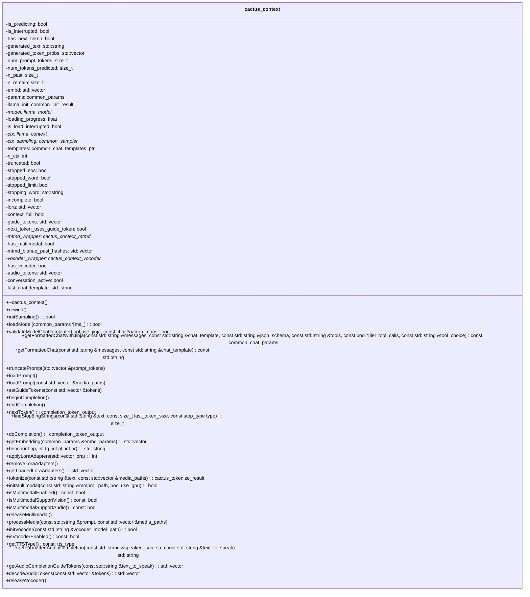
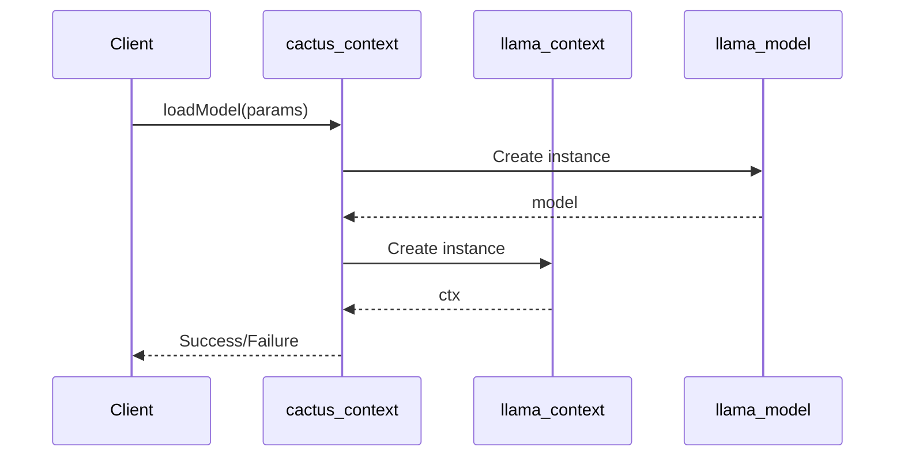
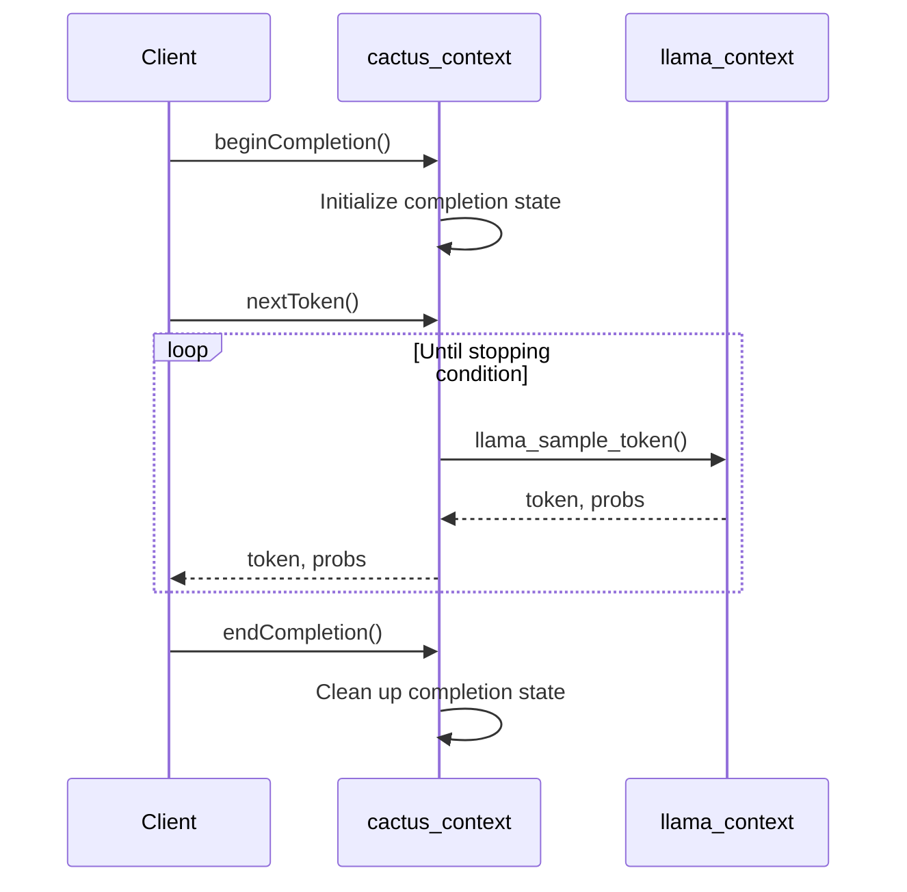
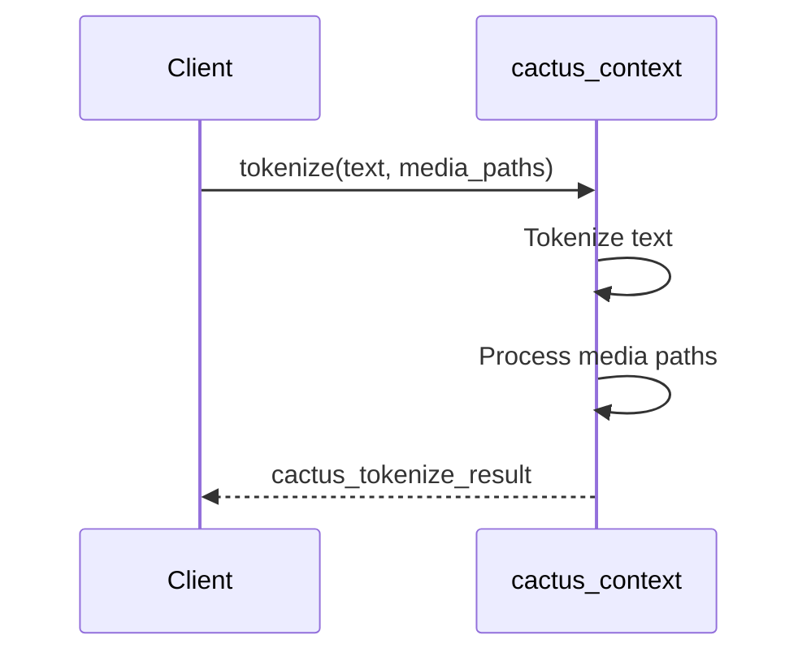
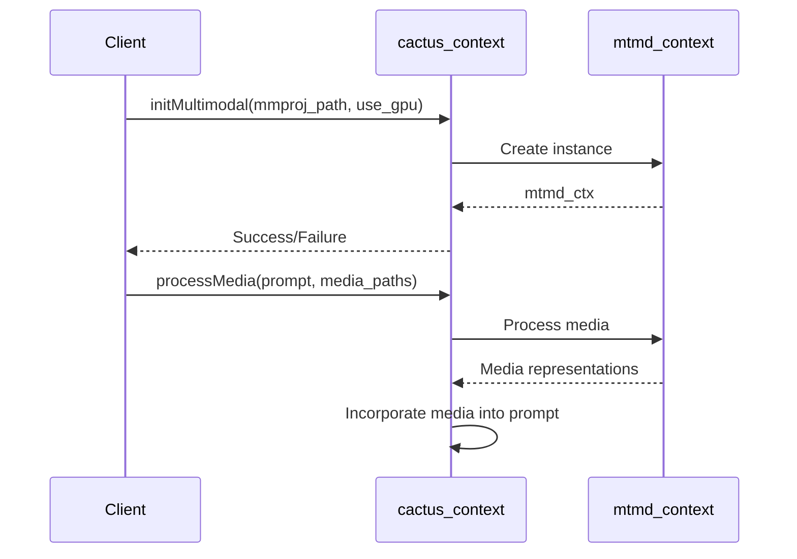
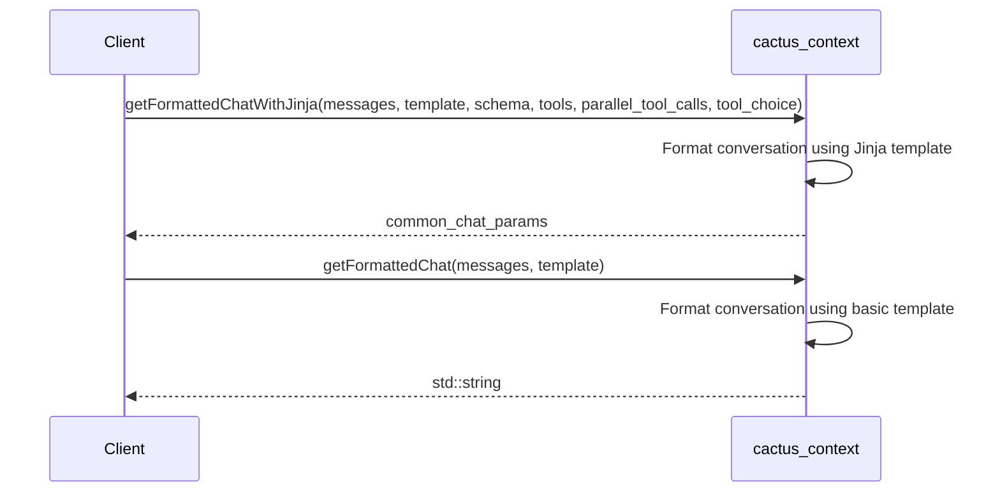
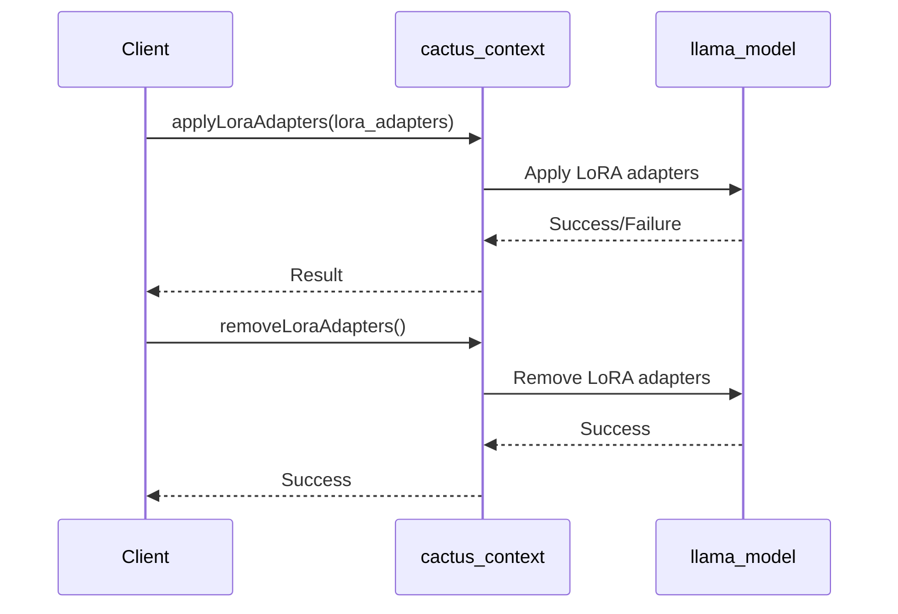

Relevant source files

The following files were used as context for generating this wiki page:

- [cpp/cactus.h](https://github.com/agattani123/cactus/blob/main/cpp/cactus.h)
- [cpp/llama.h](https://github.com/agattani123/cactus/blob/main/cpp/llama.h)
- [cpp/ggml.h](https://github.com/agattani123/cactus/blob/main/cpp/ggml.h)
- [cpp/mtmd.h](https://github.com/agattani123/cactus/blob/main/cpp/mtmd.h)
- [cpp/outetts.h](https://github.com/agattani123/cactus/blob/main/cpp/outetts.h)

# Backend Systems

## Introduction

The "Backend Systems" in this project refer to the core components and functionalities responsible for handling language model operations, such as loading models, generating text completions, and managing conversational contexts. These systems are implemented in C++ and provide a foundation for building applications that leverage large language models.

The key components of the Backend Systems include the `cactus_context` class, which encapsulates the state and operations related to a specific language model instance, and various utility functions for tokenization, sampling, and output formatting.

Sources: [cpp/cactus.h]()

## Architecture Overview

The Backend Systems follow a modular architecture, with the `cactus_context` class serving as the central component. This class manages the lifecycle of a language model instance, including loading the model, initializing sampling parameters, and handling text generation.

The `cactus_context` class interacts with other components, such as the `llama_context` and `llama_model` classes, which handle low-level operations related to the language model itself. Additionally, the Backend Systems provide support for multimodal input (e.g., images, audio) through the `mtmd_context` and `outetts` components.

Sources: [cpp/cactus.h]()

## Model Loading and Initialization

The `cactus_context` class provides methods for loading and initializing a language model. The `loadModel` method is responsible for loading the model parameters and initializing the `llama_context` and `llama_model` instances.

The `initSampling` method is used to initialize the sampling parameters for text generation, such as temperature and top-k sampling.

Sources: [cpp/cactus.h:49-52](), [cpp/cactus.h:57-58]()

## Text Generation and Completion

The Backend Systems provide functionality for generating text completions based on a given prompt. The `beginCompletion` and `endCompletion` methods are used to mark the start and end of a completion session, respectively.

The `nextToken` method is responsible for generating the next token in the completion sequence. It interacts with the `llama_context` to perform the actual token sampling and generation.

Sources: [cpp/cactus.h:70-71](), [cpp/cactus.h:73](), [cpp/cactus.h:75-76]()

## Tokenization and Output Formatting

The Backend Systems provide utility functions for tokenizing input text and formatting the generated output. The `tokenize` method is used to convert input text into a sequence of tokens that can be processed by the language model.

The `tokens_to_output_formatted_string` and `tokens_to_str` functions are used to convert the generated token sequences back into human-readable text.

Sources: [cpp/cactus.h:13-14](), [cpp/cactus.h:89]()

## Multimodal Support

The Backend Systems provide support for multimodal input, such as images and audio, through the `mtmd_context` and `outetts` components. The `initMultimodal` method is used to initialize the multimodal context, and the `processMedia` method is used to process media files (e.g., images) as part of the input prompt.

The Backend Systems also provide support for text-to-speech (TTS) functionality through the `outetts` component. The `initVocoder` method is used to initialize the vocoder model, and the `getFormattedAudioCompletion` method is used to generate audio output from text.

Sources: [cpp/cactus.h:98-102](), [cpp/cactus.h:104-105](), [cpp/cactus.h:106-107](), [cpp/cactus.h:108](), [cpp/cactus.h:110-111](), [cpp/cactus.h:113-116]()

## Conversation Management

The Backend Systems provide functionality for managing conversational contexts and chat templates. The `getFormattedChatWithJinja` and `getFormattedChat` methods are used to format the conversation history and prompts according to specified chat templates.

The `validateModelChatTemplate` method is used to validate the compatibility of a chat template with the loaded language model.

Sources: [cpp/cactus.h:61-68](), [cpp/cactus.h:69]()

## Adapter and Prompt Management

The Backend Systems provide functionality for managing language model adapters (e.g., LoRA) and prompts. The `applyLoraAdapters` and `removeLoraAdapters` methods are used to apply and remove LoRA adapters, respectively.

The `truncatePrompt` and `loadPrompt` methods are used to manage the prompt tokens that are used as input to the language model.

Sources: [cpp/cactus.h:78-79](), [cpp/cactus.h:80](), [cpp/cactus.h:81-82](), [cpp/cactus.h:83]()

## Utility Functions

The Backend Systems provide various utility functions for tasks such as finding stopping strings, getting embeddings, and benchmarking.

- `findStoppingStrings`: Used to find stopping strings (e.g., end-of-sequence tokens) in the generated text.
- `getEmbedding`: Used to generate embeddings for a given input text.
- `bench`: Used for benchmarking the language model performance.

Sources: [cpp/cactus.h:77](), [cpp/cactus.h:84](), [cpp/cactus.h:85]()

## Conclusion

The Backend Systems in this project provide a comprehensive set of functionalities for working with large language models. The `cactus_context` class serves as the central component, managing the lifecycle of a language model instance and providing methods for text generation, tokenization, multimodal input processing, and conversation management. The Backend Systems also include support for adapter management, prompt handling, and various utility functions for tasks such as finding stopping strings, generating embeddings, and benchmarking.