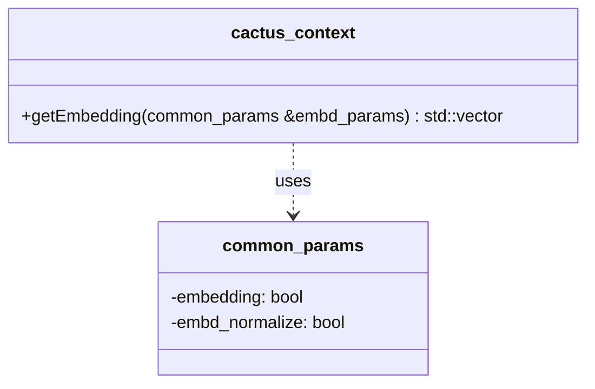
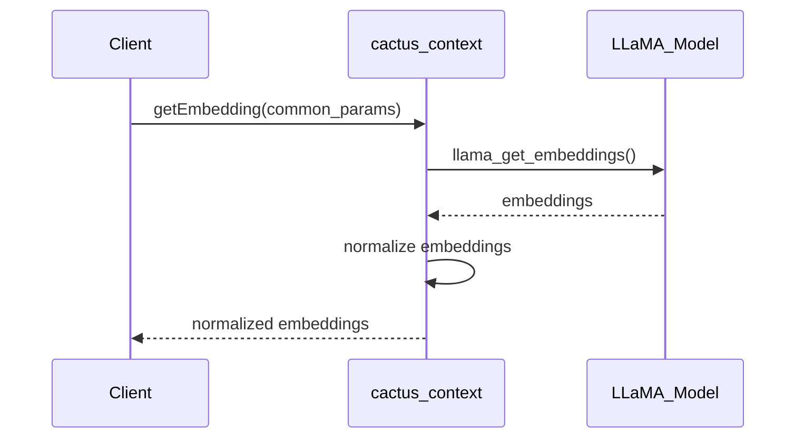
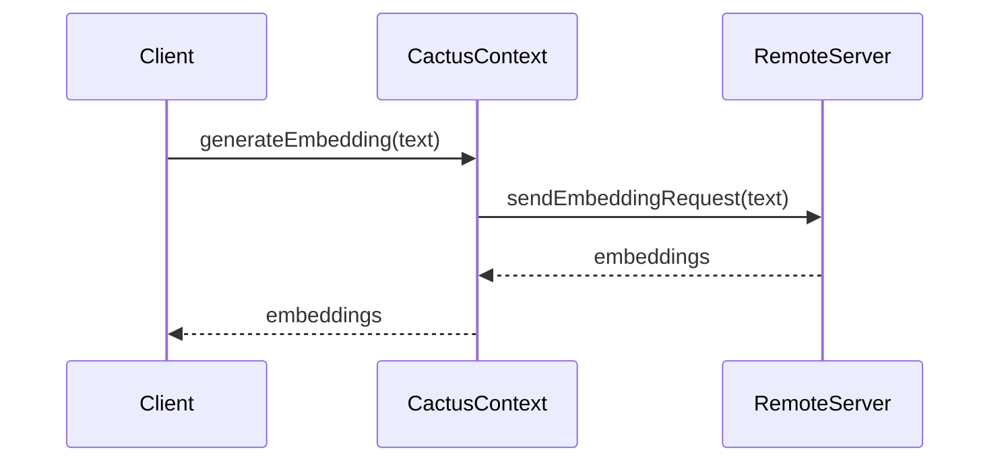

<details>
<summary>Relevant source files</summary>

The following files were used as context for generating this wiki page:

- [cpp/cactus_embedding.cpp](https://github.com/agattani123/cactus/blob/main/cpp/cactus_embedding.cpp)
- [flutter/lib/lm.dart](https://github.com/agattani123/cactus/blob/main/flutter/lib/lm.dart)
- [react/src/lm.ts](https://github.com/agattani123/cactus/blob/main/react/src/lm.ts)
</details>

# Embedding Generation

## Introduction

Embedding Generation is a core feature of the Cactus project that allows generating vector representations (embeddings) for input text. These embeddings can be used for various downstream tasks such as text classification, clustering, or similarity analysis. The Cactus project provides both local and remote embedding generation capabilities, leveraging the underlying language model (LLaMA) for efficient and accurate embedding computations.

## Local Embedding Generation

### LLaMA Model Integration

The Cactus project integrates the LLaMA (Lean, Lightweight, and Multilingual Attention) language model for local embedding generation. The `cactus_context` class in the C++ codebase serves as the primary interface for interacting with the LLaMA model and generating embeddings.



Sources: [cpp/cactus_embedding.cpp](https://github.com/agattani123/cactus/blob/main/cpp/cactus_embedding.cpp)

The `getEmbedding` method in the `cactus_context` class is responsible for generating embeddings from the LLaMA model. It takes a `common_params` object as input, which contains configuration parameters such as whether embedding mode is enabled and whether to normalize the embeddings.



Sources: [cpp/cactus_embedding.cpp:9-41](https://github.com/agattani123/cactus/blob/main/cpp/cactus_embedding.cpp#L9-L41)

The embedding generation process involves the following steps:

1. Check if the context and model are initialized.
2. Retrieve the embedding size from the LLaMA model.
3. Check if embedding mode is enabled in the configuration.
4. Obtain the raw embeddings from the LLaMA model using `llama_get_embeddings` or `llama_get_embeddings_seq` based on the pooling type.
5. Normalize the embeddings if specified in the configuration.
6. Return the normalized embeddings as a vector of floats.

### Dart/Flutter Integration

In the Dart/Flutter codebase, the `CactusContext` class serves as the entry point for embedding generation. It initializes the LLaMA model and provides methods for generating embeddings locally or remotely.

```dart
class CactusContext {
  static Future<CactusContext> init(InitParams initParams) async { /* ... */ }

  Future<EmbeddingResult> _handleLocalEmbedding(String text) async { /* ... */ }
  Future<EmbeddingResult> _handleRemoteEmbedding(String text) async { /* ... */ }
}
```

Sources: [flutter/lib/context.dart](https://github.com/agattani123/cactus/blob/main/flutter/lib/context.dart)

The `_handleLocalEmbedding` method is responsible for generating embeddings locally using the LLaMA model. It likely interacts with the C++ codebase through platform-specific bindings or a shared library.

### Error Handling and Telemetry

The Dart/Flutter codebase includes error handling and telemetry mechanisms to handle exceptions and log errors during the embedding generation process.

```dart
CactusTelemetry.error(e, initParams);
```

Sources: [flutter/lib/lm.dart:24](https://github.com/agattani123/cactus/blob/main/flutter/lib/lm.dart#L24)

The `CactusTelemetry` class is used to log errors and exceptions that occur during the initialization or embedding generation process. This helps in debugging and monitoring the application's behavior.

## Remote Embedding Generation

In addition to local embedding generation, the Cactus project supports remote embedding generation through a server-side component. This feature allows offloading computationally expensive embedding calculations to a remote server, potentially improving performance and reducing resource consumption on client devices.



Sources: [flutter/lib/lm.dart:29-31,35-37](https://github.com/agattani123/cactus/blob/main/flutter/lib/lm.dart#L29-L31,L35-L37)

The `_handleRemoteEmbedding` method in the `CactusContext` class is responsible for handling remote embedding generation. It likely sends a request to a remote server with the input text and receives the computed embeddings in response.

## Chat History Management

The Cactus project includes a chat history management component that keeps track of the conversation history and updates it with new messages and generated responses.

```dart
class HistoryManager {
  void reset() { /* ... */ }
  void update(List<ChatMessage> newMessages, ChatMessage response) { /* ... */ }
}
```

Sources: [flutter/lib/chat.dart](https://github.com/agattani123/cactus/blob/main/flutter/lib/chat.dart)

The `HistoryManager` class provides methods to reset the chat history and update it with new messages and generated responses. This history can be used for context-aware embedding generation or other conversational AI tasks.

```dart
_historyManager.reset();
_historyManager.update(processed.newMessages, ChatMessage(role: 'assistant', content: result.text));
```

Sources: [flutter/lib/lm.dart:16,18](https://github.com/agattani123/cactus/blob/main/flutter/lib/lm.dart#L16,L18)

The `lm.dart` file demonstrates the usage of the `HistoryManager` class, resetting the history and updating it with new messages and generated responses.

## Conclusion

The Embedding Generation feature in the Cactus project provides a robust and flexible mechanism for generating vector representations of input text. It leverages the LLaMA language model for local embedding generation and supports remote embedding generation for offloading computations to a server. The project also includes chat history management capabilities, enabling context-aware embedding generation and conversational AI applications.