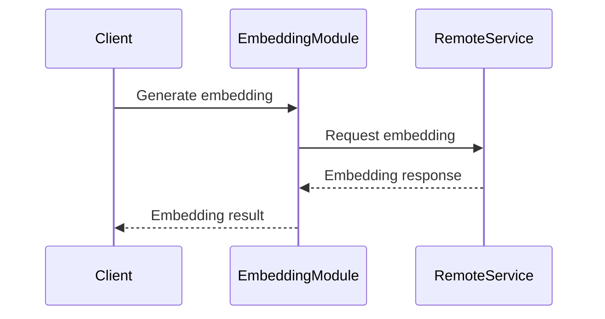
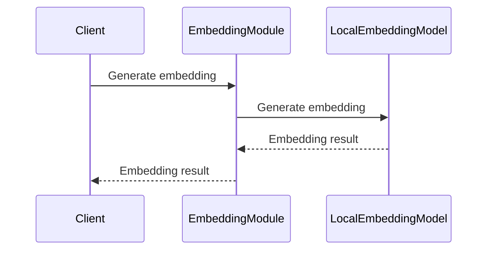

<details>
<summary>Relevant source files</summary>

The following files were used as context for generating this wiki page:

- [flutter/lib/lm.dart](https://github.com/agattani123/cactus/blob/main/flutter/lib/lm.dart)
- [react/src/lm.ts](https://github.com/agattani123/cactus/blob/main/react/src/lm.ts)
- [flutter/lib/types.dart](https://github.com/agattani123/cactus/blob/main/flutter/lib/types.dart)
- [flutter/lib/context.dart](https://github.com/agattani123/cactus/blob/main/flutter/lib/context.dart)
- [flutter/lib/telemetry.dart](https://github.com/agattani123/cactus/blob/main/flutter/lib/telemetry.dart)
- [flutter/lib/remote.dart](https://github.com/agattani123/cactus/blob/main/flutter/lib/remote.dart)
- [flutter/lib/chat.dart](https://github.com/agattani123/cactus/blob/main/flutter/lib/chat.dart)
</details>

# Embedding Generation

## Introduction

Embedding Generation is a core functionality within the Cactus project, responsible for generating embeddings (vector representations) of text inputs. These embeddings are used for various natural language processing tasks, such as text classification, similarity analysis, and information retrieval. The Embedding Generation module provides an abstraction layer that allows the application to handle embeddings from both local and remote sources seamlessly.

The module is initialized with specific parameters and a context object, which encapsulates the project's configuration and state. It manages the conversation history and handles errors and telemetry reporting. Depending on the configuration, the module can generate embeddings locally or by communicating with a remote service.

Sources: [flutter/lib/lm.dart](), [react/src/lm.ts]()

## Initialization and Setup

### Context Initialization

The Embedding Generation module relies on the `CactusContext` class to initialize the project's context. This context encapsulates various configurations and parameters required for the module's operation.

```dart
lm._context = await CactusContext.init(initParams);
```

The `init` method of `CactusContext` is an asynchronous operation that sets up the project's context based on the provided `initParams`.

Sources: [flutter/lib/lm.dart:8](), [flutter/lib/context.dart]()

### Error Handling and Telemetry

The module incorporates error handling and telemetry reporting mechanisms. If an error occurs during the initialization process, it is caught and reported through the `CactusTelemetry` class.

```dart
CactusTelemetry.error(e, initParams);
```

The `error` method of `CactusTelemetry` logs the error and associates it with the provided `initParams`.

Sources: [flutter/lib/lm.dart:9](), [flutter/lib/telemetry.dart]()

### Token and Parameters

Before generating embeddings, the module sets the Cactus token and initialization parameters.

```dart
setCactusToken(cactusToken);
lm._initParams = initParams;
```

The `setCactusToken` function sets the authentication token required for accessing Cactus services, while `_initParams` stores the initialization parameters for future use.

Sources: [flutter/lib/lm.dart:6-7]()

## Embedding Generation Flow

The Embedding Generation module provides a unified interface for generating embeddings, abstracting away the underlying implementation details (local or remote).

```dart
result = await _handleRemoteEmbedding(text);
```

```dart
result = await _handleLocalEmbedding(text);
```

The `_handleRemoteEmbedding` and `_handleLocalEmbedding` methods are responsible for generating embeddings from remote and local sources, respectively. The choice between these methods is likely determined by the project's configuration or other factors.

Sources: [flutter/lib/lm.dart:11, 13, 16, 19]()

### Remote Embedding Generation

The `_handleRemoteEmbedding` method is responsible for generating embeddings by communicating with a remote service.



The remote embedding generation process involves the following steps:

1. The client (e.g., a Flutter or React application) requests an embedding from the Embedding Generation module.
2. The module sends a request to a remote service (e.g., a server or API) to generate the embedding.
3. The remote service processes the request, generates the embedding, and sends the result back to the module.
4. The module returns the embedding result to the client.

Sources: [flutter/lib/lm.dart:11, 16, 19](), [flutter/lib/remote.dart]()

### Local Embedding Generation

The `_handleLocalEmbedding` method is responsible for generating embeddings locally, without communicating with a remote service.



The local embedding generation process involves the following steps:

1. The client (e.g., a Flutter or React application) requests an embedding from the Embedding Generation module.
2. The module invokes a local embedding model (e.g., a pre-trained machine learning model) to generate the embedding.
3. The local embedding model processes the input and generates the embedding.
4. The module returns the embedding result to the client.

Sources: [flutter/lib/lm.dart:13]()

## Conversation History Management

The Embedding Generation module manages the conversation history, which is essential for maintaining context in natural language processing tasks.

```dart
_historyManager.reset();
```

The `reset` method of the `_historyManager` object resets the conversation history, potentially at the start of a new conversation or when the context needs to be cleared.

Sources: [flutter/lib/lm.dart:10]()

```dart
_historyManager.update(processed.newMessages, ChatMessage(role: 'assistant', content: result.text));
```

The `update` method of the `_historyManager` object updates the conversation history with new messages. It takes two arguments:

1. `processed.newMessages`: A list of new messages from the user or other sources.
2. `ChatMessage(role: 'assistant', content: result.text)`: A message representing the assistant's response, with the content being the generated embedding result.

Sources: [flutter/lib/lm.dart:12](), [flutter/lib/chat.dart]()

## Error Handling

The Embedding Generation module includes error handling mechanisms to gracefully handle exceptions and errors that may occur during the embedding generation process.

```dart
lastError = e is Exception ? e : Exception(e.toString());
```

If an error occurs during the embedding generation process (either local or remote), the error is caught and stored in the `lastError` variable. If the error is an instance of the `Exception` class, it is stored directly; otherwise, a new `Exception` is created with the error's string representation.

Sources: [flutter/lib/lm.dart:15, 18, 21]()

## Conclusion

The Embedding Generation module is a crucial component of the Cactus project, responsible for generating embeddings from text inputs. It provides a unified interface for handling both local and remote embedding generation, abstracting away the underlying implementation details. The module manages conversation history, handles errors, and integrates with telemetry reporting mechanisms. By leveraging this module, the Cactus project can efficiently generate embeddings for various natural language processing tasks while maintaining flexibility and scalability.