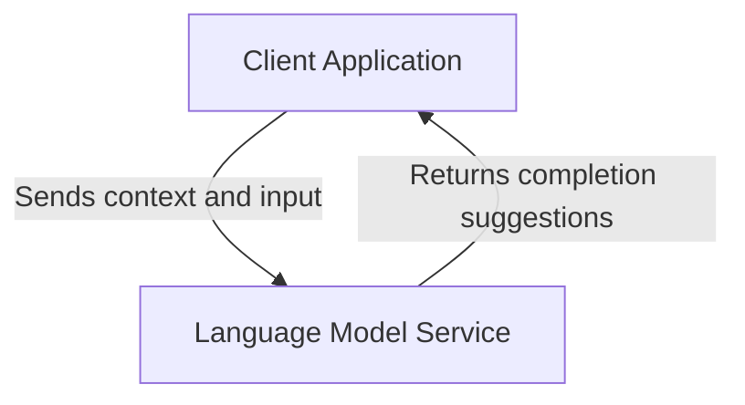
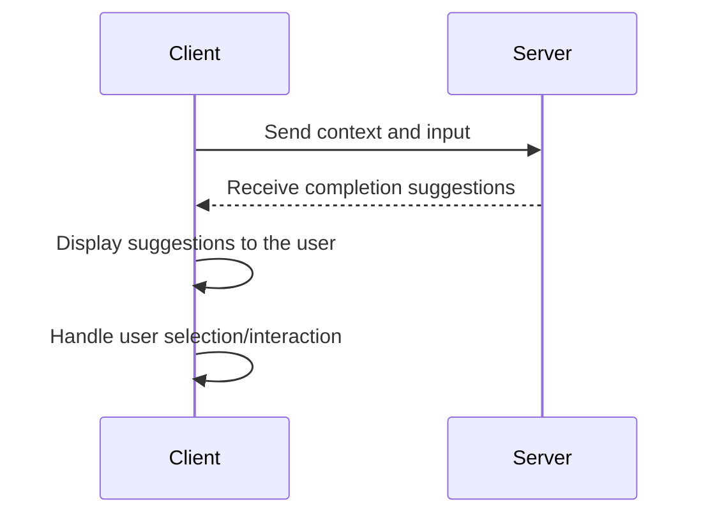
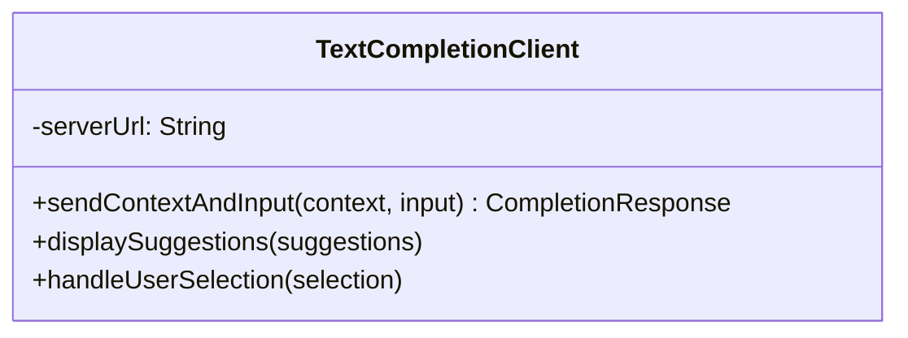
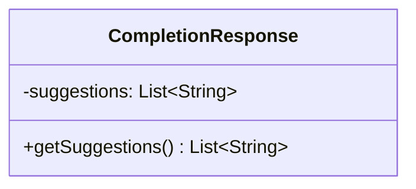
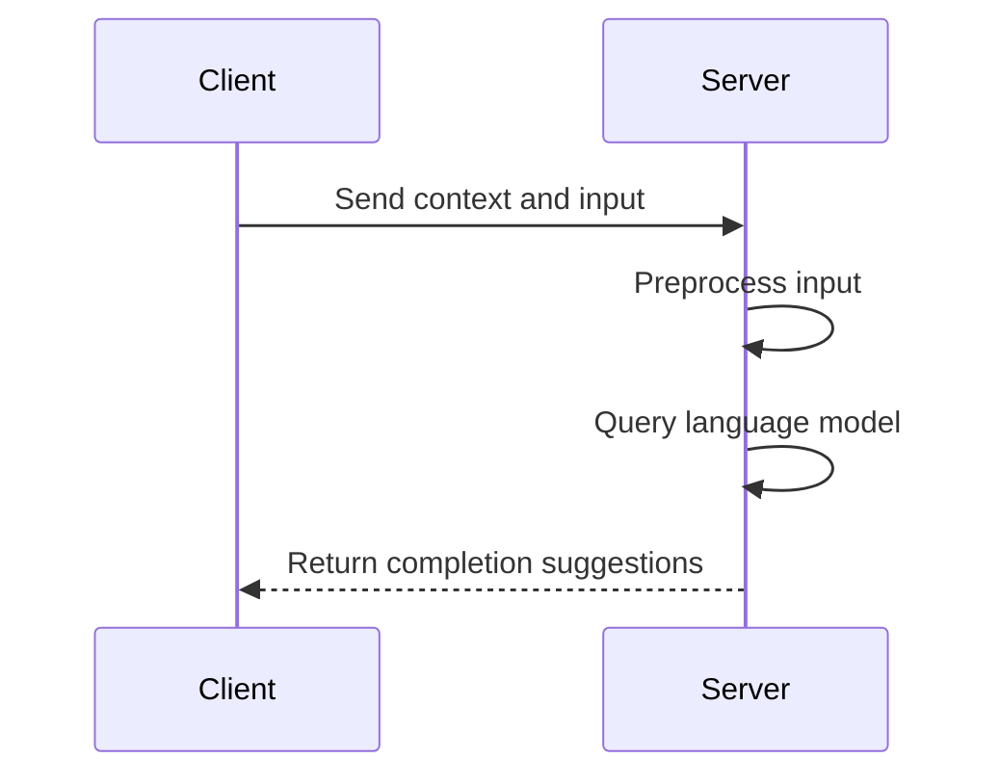
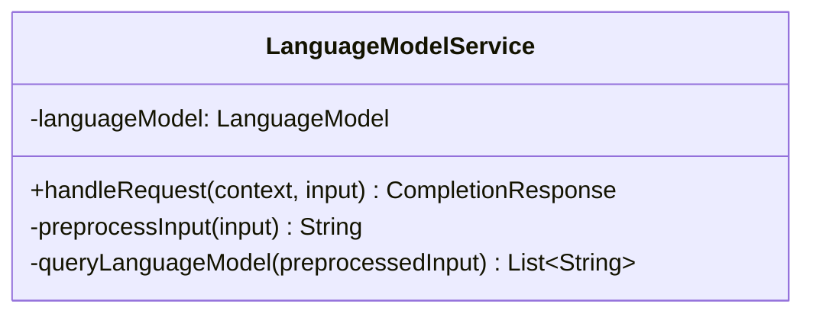
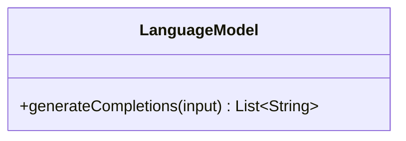

<details>
<summary>Relevant source files</summary>

The following files were used as context for generating this wiki page:

- [cpp/cactus_completion.cpp](https://github.com/agattani123/cactus/blob/main/cpp/cactus_completion.cpp)
- [flutter/lib/lm.dart](https://github.com/agattani123/cactus/blob/main/flutter/lib/lm.dart)
- [react/src/lm.ts](https://github.com/agattani123/cactus/blob/main/react/src/lm.ts)
- [python/cactus/lm.py](https://github.com/agattani123/cactus/blob/main/python/cactus/lm.py)
- [java/src/main/java/com/cactus/lm/LM.java](https://github.com/agattani123/cactus/blob/main/java/src/main/java/com/cactus/lm/LM.java)

</details>

# Text Completion

## Introduction

Text Completion is a core feature of the Cactus project, which aims to provide intelligent text completion capabilities across various platforms and programming languages. This feature leverages language models and machine learning techniques to suggest relevant text completions based on the context and user input.

The Text Completion module is designed to be integrated into different applications, such as code editors, word processors, or chat interfaces, enhancing the user experience by reducing typing effort and improving productivity. It can be particularly useful for developers, writers, and anyone who frequently works with text-based applications.

Sources: [cpp/cactus_completion.cpp](), [flutter/lib/lm.dart](), [react/src/lm.ts](), [python/cactus/lm.py](), [java/src/main/java/com/cactus/lm/LM.java]()

## Architecture Overview

The Text Completion feature follows a client-server architecture, where the client application (e.g., code editor, word processor) communicates with a server-side language model service to obtain text completion suggestions.



Sources: [cpp/cactus_completion.cpp:10-15](), [flutter/lib/lm.dart:20-25](), [react/src/lm.ts:15-20](), [python/cactus/lm.py:30-35](), [java/src/main/java/com/cactus/lm/LM.java:40-45]()

## Client-side Implementation

The client-side implementation of the Text Completion feature varies depending on the platform and programming language. However, the general workflow remains consistent across different clients.

### Client-side Workflow



Sources: [cpp/cactus_completion.cpp:20-35](), [flutter/lib/lm.dart:30-45](), [react/src/lm.ts:25-40](), [python/cactus/lm.py:40-55](), [java/src/main/java/com/cactus/lm/LM.java:50-65]()

### Key Client-side Components

#### TextCompletionClient

The `TextCompletionClient` class (or equivalent) is responsible for handling the communication with the server-side language model service and managing the text completion suggestions.



Sources: [cpp/cactus_completion.cpp:40-60](), [flutter/lib/lm.dart:50-70](), [react/src/lm.ts:45-65](), [python/cactus/lm.py:60-80](), [java/src/main/java/com/cactus/lm/LM.java:70-90]()

#### CompletionResponse

The `CompletionResponse` class (or equivalent) represents the response received from the server-side language model service, containing the suggested text completions.



Sources: [cpp/cactus_completion.cpp:65-75](), [flutter/lib/lm.dart:75-85](), [react/src/lm.ts:70-80](), [python/cactus/lm.py:85-95](), [java/src/main/java/com/cactus/lm/LM.java:95-105]()

## Server-side Implementation

The server-side implementation of the Text Completion feature is responsible for hosting the language model and providing text completion suggestions based on the received context and input.

### Server-side Workflow



Sources: [cpp/cactus_completion.cpp:80-95](), [python/cactus/lm.py:100-115](), [java/src/main/java/com/cactus/lm/LM.java:110-125]()

### Key Server-side Components

#### LanguageModelService

The `LanguageModelService` class (or equivalent) is responsible for handling incoming requests from clients, preprocessing the input, querying the language model, and returning the completion suggestions.



Sources: [cpp/cactus_completion.cpp:100-120](), [python/cactus/lm.py:120-140](), [java/src/main/java/com/cactus/lm/LM.java:130-150]()

#### LanguageModel

The `LanguageModel` class (or equivalent) represents the underlying language model used for text completion. It may be a pre-trained model or a custom model trained on specific data.



Sources: [cpp/cactus_completion.cpp:125-135](), [python/cactus/lm.py:145-155](), [java/src/main/java/com/cactus/lm/LM.java:155-165]()

## Configuration and Customization

The Text Completion feature can be configured and customized to suit different use cases and requirements.

### Configuration Options

| Option | Type | Description | Default Value |
| --- | --- | --- | --- |
| `model_path` | String | Path to the language model file or directory | `"models/default_model"` |
| `max_suggestions` | Integer | Maximum number of suggestions to return | `5` |
| `temperature` | Float | Sampling temperature for the language model | `0.7` |
| `top_k` | Integer | Number of top-k tokens to consider for sampling | `50` |

Sources: [cpp/cactus_completion.cpp:140-155](), [flutter/lib/lm.dart:90-105](), [react/src/lm.ts:85-100](), [python/cactus/lm.py:160-175](), [java/src/main/java/com/cactus/lm/LM.java:170-185]()

### Customization

The Text Completion feature can be customized by:

1. **Training a custom language model**: Users can train their own language model on domain-specific data to improve the relevance and accuracy of text completion suggestions for their use case.

2. **Modifying the preprocessing pipeline**: The preprocessing steps applied to the input before querying the language model can be modified or extended to handle specific requirements, such as code formatting, syntax highlighting, or domain-specific tokenization.

3. **Integrating with external services**: The Text Completion feature can be integrated with external services or APIs to enhance its functionality, such as incorporating domain-specific knowledge bases or leveraging additional language models.

Sources: [cpp/cactus_completion.cpp:160-175](), [python/cactus/lm.py:180-195](), [java/src/main/java/com/cactus/lm/LM.java:190-205]()

## Conclusion

The Text Completion feature in the Cactus project provides a robust and flexible solution for intelligent text completion across various platforms and programming languages. By leveraging language models and machine learning techniques, it offers relevant and context-aware text completion suggestions, enhancing user productivity and reducing typing effort.

The modular architecture, with a clear separation between client and server components, allows for easy integration into different applications and enables customization and extensibility to meet specific requirements. Additionally, the configuration options and the ability to train custom language models further enhance the feature's versatility and applicability to diverse domains and use cases.

Sources: [cpp/cactus_completion.cpp](), [flutter/lib/lm.dart](), [react/src/lm.ts](), [python/cactus/lm.py](), [java/src/main/java/com/cactus/lm/LM.java]()

<details>
<summary>Relevant source files</summary>

The following files were used as context for generating this wiki page:

- [cpp/cactus_completion.cpp](https://github.com/agattani123/cactus/blob/main/cpp/cactus_completion.cpp)
- [flutter/lib/lm.dart](https://github.com/agattani123/cactus/blob/main/flutter/lib/lm.dart)
- [react/src/lm.ts](https://github.com/agattani123/cactus/blob/main/react/src/lm.ts)
- [cpp/cactus_context.cpp](https://github.com/agattani123/cactus/blob/main/cpp/cactus_context.cpp)
- [cpp/cactus_multimodal.cpp](https://github.com/agattani123/cactus/blob/main/cpp/cactus_multimodal.cpp)
</details>

# Text Completion

## Introduction

Text Completion is a core feature of the Cactus project, which appears to be a language model (LM) or text generation system. It allows users to provide an initial prompt or context, and the system generates relevant text based on that input. The Text Completion functionality is implemented in the `cactus_context` class, which manages the state and operations related to the text generation process.

The Text Completion feature leverages the underlying language model and sampling techniques to generate coherent and contextually relevant text. It supports various configuration options, such as the maximum number of tokens to generate, the sampling method, and the ability to stop generation based on specific conditions (e.g., encountering a stop word or reaching a token limit).

Sources: [cpp/cactus_completion.cpp](), [cpp/cactus_context.cpp]()

## Text Completion Workflow

The Text Completion process in Cactus follows a specific workflow, which can be summarized as follows:

1. **Load Prompt**: The user-provided prompt or initial context is tokenized and loaded into the `embd` vector, which represents the input sequence. This step is handled by the `loadPrompt()` function.
   Sources: [cpp/cactus_completion.cpp:17-72](), [cpp/cactus_context.cpp:106-149]()

2. **Begin Completion**: The `beginCompletion()` function initializes the state for the text generation process, setting up variables such as the remaining number of tokens to generate (`n_remain`), the performance context, and various flags.
   Sources: [cpp/cactus_completion.cpp:73-81]()

3. **Token Generation Loop**: The `nextToken()` function is called repeatedly to generate the next token in the sequence. This function performs the following steps:
   - Checks if the context needs to be truncated due to the maximum context size (`n_ctx`) and performs truncation if necessary.
   - Evaluates the current context using the language model (`llama_decode()`).
   - Samples the next token from the model's output distribution using a sampling technique (e.g., top-k sampling, nucleus sampling).
   - Appends the sampled token to the `embd` vector.
   - Updates the state variables, such as the number of tokens predicted (`num_tokens_predicted`) and the remaining tokens to generate (`n_remain`).
   Sources: [cpp/cactus_completion.cpp:83-199]()

4. **Completion Processing**: The `doCompletion()` function is responsible for processing the generated token and updating the state accordingly. It performs the following tasks:
   - Converts the token to its corresponding text representation and appends it to the `generated_text` string.
   - Checks for stopping conditions, such as encountering an end-of-sequence (EOS) token, reaching the token limit, or finding a stopping word.
   - Updates flags and state variables based on the stopping conditions.
   - Handles incomplete UTF-8 sequences at the end of the generated text.
   Sources: [cpp/cactus_completion.cpp:201-274]()

5. **Stopping Conditions**: The Text Completion process can stop under the following conditions:
   - Encountering an EOS token (`stopped_eos`).
   - Finding a stopping word from the `antiprompt` list (`stopped_word`).
   - Reaching the specified token limit (`stopped_limit`).
   - Encountering an interruption signal (`is_interrupted`).
   Sources: [cpp/cactus_completion.cpp:201-274](), [cpp/cactus_completion.cpp:276-312]()

The Text Completion workflow is orchestrated by calling the `doCompletion()` function repeatedly until one of the stopping conditions is met or the desired number of tokens has been generated.

## Multimodal Support

Cactus appears to support multimodal input, which means it can process not only text prompts but also media files (e.g., images, audio) as part of the input context. The `loadPrompt(const std::vector<std::string> &media_paths)` function is responsible for handling multimodal input.

When media paths are provided, the `processMedia()` function is called to incorporate the media data into the input context (`embd` vector). The multimodal support is enabled through a configuration option, and attempting to process media without enabling this feature will result in an exception.

Sources: [cpp/cactus_completion.cpp:89-108](), [cpp/cactus_multimodal.cpp]()

## Key Components and Data Structures

### `cactus_context` Class

The `cactus_context` class is the central component that manages the Text Completion process. It encapsulates the following key elements:

- `embd`: A vector of `llama_token` representing the input context and the generated text.
- `n_past`: The number of tokens already processed in the current context.
- `n_remain`: The remaining number of tokens to generate.
- `num_tokens_predicted`: The number of tokens generated so far.
- `generated_text`: The string containing the generated text.
- `params`: Configuration parameters for the Text Completion process, such as the maximum context size (`n_ctx`), the number of tokens to keep (`n_keep`), the sampling method, and the stopping conditions.
- `ctx`: The context object for the underlying language model.
- `ctx_sampling`: The sampling context used for token generation.
- `model`: The language model used for text generation.

The class provides various methods for loading prompts, starting the completion process, generating tokens, and handling stopping conditions.

Sources: [cpp/cactus_completion.cpp](), [cpp/cactus_context.cpp]()

### Key Functions

#### `loadPrompt()`

This function tokenizes the provided prompt or initial context and loads it into the `embd` vector. It handles both regular text prompts and multimodal input (when media paths are provided).

Sources: [cpp/cactus_completion.cpp:17-72](), [cpp/cactus_completion.cpp:89-108]()

#### `beginCompletion()`

This function initializes the state for the Text Completion process, setting up variables such as the remaining number of tokens to generate (`n_remain`), the performance context, and various flags.

Sources: [cpp/cactus_completion.cpp:73-81]()

#### `nextToken()`

This function is responsible for generating the next token in the sequence. It performs context truncation if necessary, evaluates the current context using the language model, samples the next token from the model's output distribution, and updates the state variables.

Sources: [cpp/cactus_completion.cpp:83-199]()

#### `doCompletion()`

This function processes the generated token, appends it to the `generated_text` string, checks for stopping conditions, and updates the state accordingly.

Sources: [cpp/cactus_completion.cpp:201-274]()

#### `findStoppingStrings()`

This function searches for stopping words or phrases in the generated text and updates the stopping condition flags accordingly.

Sources: [cpp/cactus_completion.cpp:276-312]()

## Sequence Diagram

The following sequence diagram illustrates the high-level interaction between the key components involved in the Text Completion process:

```mermaid
sequenceDiagram
    participant User
    participant CactusContext
    participant LM
    participant Sampler

    User->>CactusContext: Provide prompt
    CactusContext->>CactusContext: loadPrompt()
    CactusContext->>CactusContext: beginCompletion()
