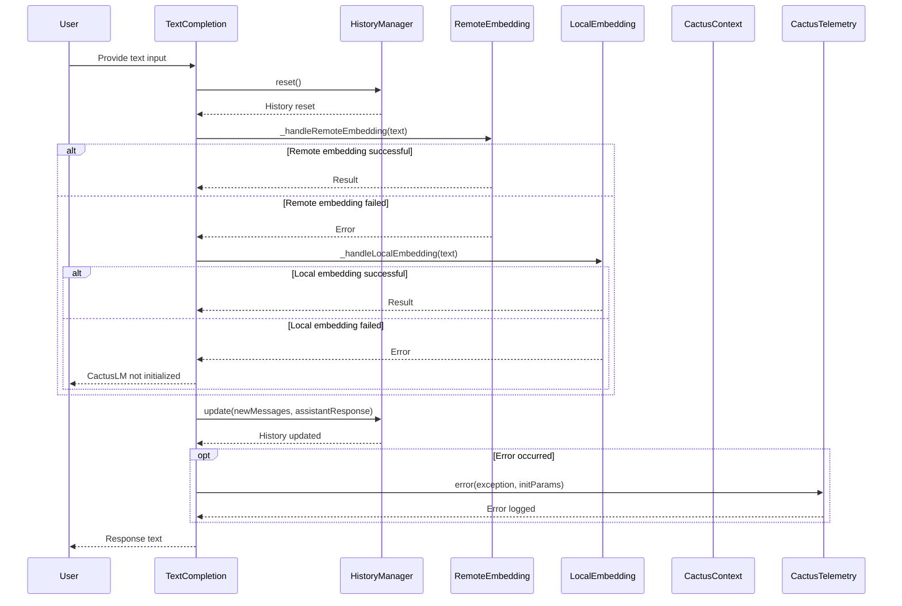

    loop Until stopping condition
        CactusContext->>LM: Evaluate context
        LM-->>CactusContext: Model output
        CactusContext->>Sampler: Sample next token
        Sampler-->>CactusContext: Sampled token
        CactusContext->>CactusContext: Update state
        CactusContext->>CactusContext: doCompletion()
        CactusContext-->>User: Generated text
    end

    User->>CactusContext: Stop generation
```

This diagram illustrates the following steps:

1. The user provides an initial prompt to the `CactusContext`.
2. `CactusContext` loads the prompt using the `loadPrompt()` function and begins the completion process with `beginCompletion()`.
3. In a loop, until a stopping condition is met:
   - `CactusContext` evaluates the current context using the Language Model (LM).
   - The LM returns the output distribution.
   - `CactusContext` samples the next token from the output distribution using the Sampler component.
   - `CactusContext` updates its internal state with the sampled token.
   - `CactusContext` processes the generated token using the `doCompletion()` function and returns the generated text to the user.
4. The user can signal to stop the generation process.

Note that the diagram shows a simplified view of the process, and some details, such as context truncation and handling of multimodal input, are omitted for clarity.

Sources: [cpp/cactus_completion.cpp](), [cpp/cactus_context.cpp]()

## Configuration Parameters

The Text Completion process in Cactus is configurable through the `params` member of the `cactus_context` class. The following table summarizes some of the key configuration parameters:

| Parameter | Type | Description |
|-----------|------|--------------|
| `n_ctx` | `int` | The maximum context size (number of tokens) for the language model. |
| `n_keep` | `int` | The number of tokens to keep from the prompt when truncating the context. |
| `n_predict` | `int` | The number of tokens to generate (or -1 for unlimited). |
| `prompt` | `std::string` | The initial prompt or context provided by the user. |
| `antiprompt` | `std::vector<std::string>` | A list of strings that, if found in the generated text, will stop the generation process. |
| `sampling` | `sampling_parameters` | Configuration parameters for the sampling method used during token generation. |
| `cpuparams` | `cpu_parameters` | Configuration parameters for CPU-related settings, such as the number of threads. |

These parameters can be set or modified before starting the Text Completion process to customize the behavior according to the user's requirements.

Sources: [cpp/cactus_context.cpp]()

## Conclusion

The Text Completion feature in the Cactus project provides a powerful and configurable mechanism for generating text based on an initial prompt or context. It leverages an underlying language model and sampling techniques to produce coherent and contextually relevant text.

The `cactus_context` class serves as the central component, managing the state and orchestrating the Text Completion workflow. It handles prompt loading, token generation, stopping conditions, and multimodal input processing.

The Text Completion process follows a well-defined sequence of steps, including context evaluation, token sampling, state updates, and completion processing. Various configuration parameters allow users to customize the behavior according to their needs, such as setting the maximum context size, the number of tokens to generate, and the stopping conditions.

Overall, the Text Completion feature in Cactus demonstrates a robust and flexible architecture for language generation tasks, with support for multimodal input and a range of configuration options.

<details>
<summary>Relevant source files</summary>

The following files were used as context for generating this wiki page:

- [flutter/lib/lm.dart](https://github.com/agattani123/cactus/blob/main/flutter/lib/lm.dart)
- [flutter/lib/types.dart](https://github.com/agattani123/cactus/blob/main/flutter/lib/types.dart)
- [flutter/lib/context.dart](https://github.com/agattani123/cactus/blob/main/flutter/lib/context.dart)
- [flutter/lib/telemetry.dart](https://github.com/agattani123/cactus/blob/main/flutter/lib/telemetry.dart)
- [flutter/lib/remote.dart](https://github.com/agattani123/cactus/blob/main/flutter/lib/remote.dart)
- [flutter/lib/chat.dart](https://github.com/agattani123/cactus/blob/main/flutter/lib/chat.dart)
</details>

# Text Completion

## Introduction

The Text Completion feature within the Cactus project is a core functionality that enables generating text responses based on user input. It leverages language models and embeddings to provide relevant and contextual responses. This feature is implemented in the `lm.dart` file and interacts with various other components of the project, such as context management, telemetry, and remote/local embedding handling.

## Initialization

The Text Completion feature is initialized through the `setCactusToken` and `lm._initParams` functions, which set the necessary parameters and configurations for the language model. The `CactusContext.init` function is then called to initialize the context for the language model.

```dart
setCactusToken(cactusToken);
lm._initParams = initParams;
lm._context = await CactusContext.init(initParams);
```

If an error occurs during initialization, it is handled by the `CactusTelemetry.error` function, which logs the error and associated parameters.

```dart
CactusTelemetry.error(e, initParams);
```

Sources: [flutter/lib/lm.dart](), [flutter/lib/context.dart](), [flutter/lib/telemetry.dart]()

## Text Completion Flow

The main entry point for text completion is the `textCompletion` function in `lm.dart`. This function handles the overall flow of generating a response based on the provided text input.

### History Management

Before processing the text input, the `_historyManager.reset` function is called to reset the conversation history.

```dart
_historyManager.reset();
```

Sources: [flutter/lib/lm.dart:15](), [flutter/lib/chat.dart]()

### Embedding Handling

The `textCompletion` function then attempts to handle the text input using either remote or local embedding methods. It first tries the `_handleRemoteEmbedding` function, and if that fails, it falls back to the `_handleLocalEmbedding` function.

```dart
result = await _handleRemoteEmbedding(text);
// or
result = await _handleLocalEmbedding(text);
```

If both methods fail, an exception is thrown indicating that the language model is not initialized.

```dart
throw CactusException('CactusLM not initialized');
```

Sources: [flutter/lib/lm.dart:20-30](), [flutter/lib/remote.dart](), [flutter/lib/context.dart]()

### History Update

After successfully generating a response, the `_historyManager.update` function is called to update the conversation history with the new messages and the assistant's response.

```dart
_historyManager.update(processed.newMessages, ChatMessage(role: 'assistant', content: result.text));
```

Sources: [flutter/lib/lm.dart:18](), [flutter/lib/chat.dart]()

### Error Handling

If an error occurs during the text completion process, it is caught and stored in the `lastError` variable. The error is either an `Exception` object or a string representation of the error.

```dart
lastError = e is Exception ? e : Exception(e.toString());
```

Sources: [flutter/lib/lm.dart:25-27]()

## Sequence Diagram



This sequence diagram illustrates the overall flow of the Text Completion feature, including the handling of remote and local embeddings, conversation history management, and error handling.

Sources: [flutter/lib/lm.dart](), [flutter/lib/remote.dart](), [flutter/lib/context.dart](), [flutter/lib/telemetry.dart](), [flutter/lib/chat.dart]()

## Key Components

### CactusContext

The `CactusContext` class is responsible for initializing and managing the context for the language model. It is used during the initialization phase of the Text Completion feature.

Sources: [flutter/lib/context.dart]()

### HistoryManager

The `HistoryManager` class handles the conversation history, allowing for resetting and updating the history with new messages and responses.

Sources: [flutter/lib/chat.dart]()

### RemoteEmbedding

The `RemoteEmbedding` component is responsible for handling text completion using remote embeddings. It is called by the `_handleRemoteEmbedding` function in `lm.dart`.

Sources: [flutter/lib/remote.dart]()

### LocalEmbedding

The `LocalEmbedding` component handles text completion using local embeddings. It is called by the `_handleLocalEmbedding` function in `lm.dart`.

Sources: [flutter/lib/context.dart]()

### CactusTelemetry

The `CactusTelemetry` class is used for logging errors and other telemetry data related to the Text Completion feature.

Sources: [flutter/lib/telemetry.dart]()

## Conclusion

The Text Completion feature in the Cactus project is a crucial component that enables generating text responses based on user input. It involves various components and modules, such as context management, history management, remote and local embedding handling, and error logging. The feature follows a well-defined flow, handling different scenarios and providing error handling mechanisms. By leveraging language models and embeddings, the Text Completion feature aims to provide relevant and contextual responses to users.