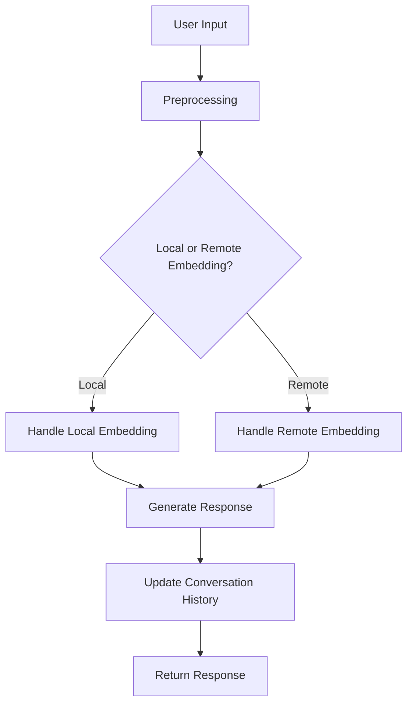
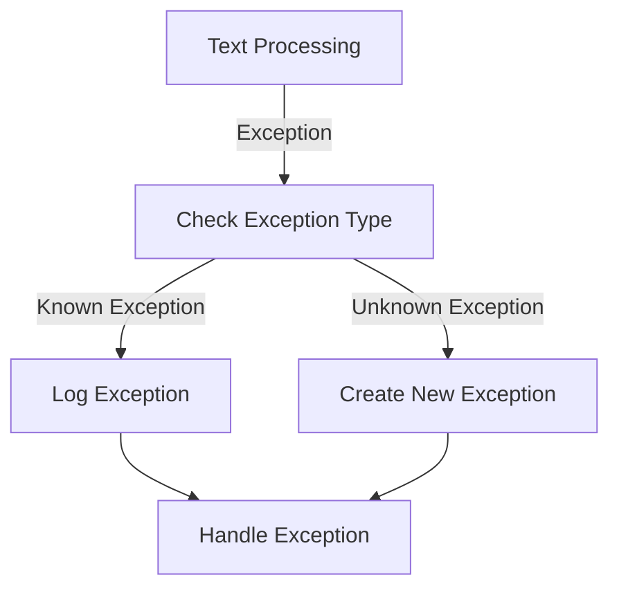

<details>
<summary>Relevant source files</summary>

The following files were used as context for generating this wiki page:

- [flutter/lib/lm.dart](https://github.com/agattani123/cactus/blob/main/flutter/lib/lm.dart)
- [react/src/lm.ts](https://github.com/agattani123/cactus/blob/main/react/src/lm.ts)
- [flutter/lib/types.dart](https://github.com/agattani123/cactus/blob/main/flutter/lib/types.dart)
- [flutter/lib/context.dart](https://github.com/agattani123/cactus/blob/main/flutter/lib/context.dart)
- [flutter/lib/telemetry.dart](https://github.com/agattani123/cactus/blob/main/flutter/lib/telemetry.dart)
- [flutter/lib/remote.dart](https://github.com/agattani123/cactus/blob/main/flutter/lib/remote.dart)
- [flutter/lib/chat.dart](https://github.com/agattani123/cactus/blob/main/flutter/lib/chat.dart)
</details>

# Text Completion

## Introduction

Text Completion is a core feature of the Cactus project, responsible for generating human-like responses to user input. It leverages language models and embeddings to understand the context and intent of the input text, and then generates a relevant and coherent response. Text Completion is a crucial component for various applications within the project, such as chatbots, virtual assistants, and content generation tools.

The Text Completion module handles the entire lifecycle of processing user input, managing conversation history, and generating responses. It supports both local and remote embeddings, allowing for flexibility in deployment and performance optimization. Additionally, it integrates with other modules like `CactusContext` for context management, `CactusTelemetry` for error handling and telemetry, and `ChatMessage` for representing conversation messages.

## Initialization and Setup

### Cactus Token and Initialization Parameters

Before using the Text Completion module, the `setCactusToken` function must be called to set the Cactus token, which is likely required for authentication or authorization purposes. Additionally, initialization parameters (`initParams`) are assigned to the `lm._initParams` property.

```dart
setCactusToken(cactusToken);
lm._initParams = initParams;
```

Sources: [flutter/lib/lm.dart](https://github.com/agattani123/cactus/blob/main/flutter/lib/lm.dart)

### Context Initialization

The `CactusContext` module is initialized using the `CactusContext.init` function, passing the `initParams` as an argument. The resulting context is assigned to the `lm._context` property.

```dart
lm._context = await CactusContext.init(initParams);
```

If an error occurs during context initialization, it is caught and logged using the `CactusTelemetry.error` function, which likely sends the error and initialization parameters to a telemetry system for monitoring and debugging purposes.

```dart
CactusTelemetry.error(e, initParams);
```

Sources: [flutter/lib/lm.dart](https://github.com/agattani123/cactus/blob/main/flutter/lib/lm.dart), [flutter/lib/context.dart](https://github.com/agattani123/cactus/blob/main/flutter/lib/context.dart), [flutter/lib/telemetry.dart](https://github.com/agattani123/cactus/blob/main/flutter/lib/telemetry.dart)

## Text Completion Flow

The Text Completion module follows a specific flow to process user input and generate responses. The flow is depicted in the following diagram:



1. The user input text is received and preprocessed if necessary.
2. Based on the configuration or context, the module decides whether to use local or remote embeddings for text processing.
3. If local embeddings are used, the `_handleLocalEmbedding` function is called to process the text locally.
4. If remote embeddings are used, the `_handleRemoteEmbedding` function is called to process the text remotely, likely by sending the text to a remote service or API.
5. The appropriate embedding handling function generates the response text.
6. The conversation history is updated with the user input and the generated response using the `_historyManager.update` function and the `ChatMessage` data structure.
7. The generated response is returned to the caller.

Sources: [flutter/lib/lm.dart](https://github.com/agattani123/cactus/blob/main/flutter/lib/lm.dart), [flutter/lib/remote.dart](https://github.com/agattani123/cactus/blob/main/flutter/lib/remote.dart), [flutter/lib/chat.dart](https://github.com/agattani123/cactus/blob/main/flutter/lib/chat.dart)

## Error Handling

The Text Completion module includes error handling mechanisms to gracefully handle exceptions and errors that may occur during the text processing flow. The error handling logic is as follows:



1. If an exception occurs during text processing (e.g., `_handleLocalEmbedding`, `_handleRemoteEmbedding`), the exception is caught.
2. The caught exception is checked to determine if it is a known exception type (e.g., an instance of `Exception`).
3. If the exception is a known type, it is logged directly using the `CactusTelemetry.error` function.
4. If the exception is an unknown type (e.g., a string or other object), a new `Exception` instance is created with the string representation of the exception.
5. The logged exception or the newly created `Exception` instance is then handled appropriately, likely by displaying an error message or taking appropriate action based on the project's requirements.

```dart
try {
    // Text processing logic
} catch (e) {
    if (e is Exception) {
        CactusTelemetry.error(e, initParams);
    } else {
        lastError = Exception(e.toString());
        CactusTelemetry.error(lastError, initParams);
    }
    // Handle the exception
}
```

Sources: [flutter/lib/lm.dart](https://github.com/agattani123/cactus/blob/main/flutter/lib/lm.dart), [flutter/lib/telemetry.dart](https://github.com/agattani123/cactus/blob/main/flutter/lib/telemetry.dart)

## Conversation History Management

The Text Completion module manages the conversation history using the `_historyManager` component. The conversation history is represented as a collection of `ChatMessage` objects, which contain the role (e.g., "user" or "assistant") and the corresponding message content.

### Resetting Conversation History

The conversation history can be reset using the `_historyManager.reset()` function, which clears the existing history.

```dart
_historyManager.reset();
```

Sources: [flutter/lib/lm.dart](https://github.com/agattani123/cactus/blob/main/flutter/lib/lm.dart), [flutter/lib/chat.dart](https://github.com/agattani123/cactus/blob/main/flutter/lib/chat.dart)

### Updating Conversation History

After generating a response, the conversation history is updated with the user input and the generated response using the `_historyManager.update` function. The function takes two arguments:

1. `processed.newMessages`: A list of `ChatMessage` objects representing the user input messages.
2. `ChatMessage(role: 'assistant', content: result.text)`: A `ChatMessage` object representing the generated response, with the role set to "assistant" and the content set to the generated text.

```dart
_historyManager.update(processed.newMessages, ChatMessage(role: 'assistant', content: result.text));
```

Sources: [flutter/lib/lm.dart](https://github.com/agattani123/cactus/blob/main/flutter/lib/lm.dart), [flutter/lib/chat.dart](https://github.com/agattani123/cactus/blob/main/flutter/lib/chat.dart)

## Conclusion

The Text Completion module is a crucial component of the Cactus project, responsible for generating human-like responses to user input. It handles the entire lifecycle of text processing, including context management, local and remote embeddings, conversation history management, and error handling. By leveraging language models and embeddings, the module can understand the context and intent of user input and generate relevant and coherent responses.

The module follows a well-defined flow, starting with preprocessing user input, deciding between local or remote embeddings, generating the response, and updating the conversation history. Error handling mechanisms ensure that exceptions and errors are caught and logged appropriately, allowing for better debugging and monitoring.

Overall, the Text Completion module plays a vital role in enabling various applications within the Cactus project, such as chatbots, virtual assistants, and content generation tools, by providing a robust and flexible text processing capability.