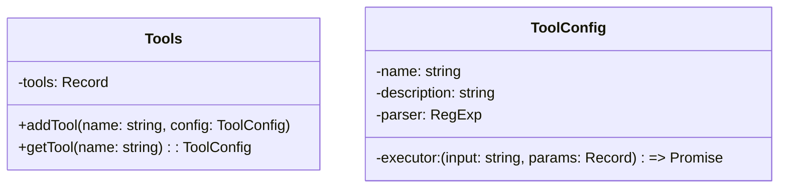
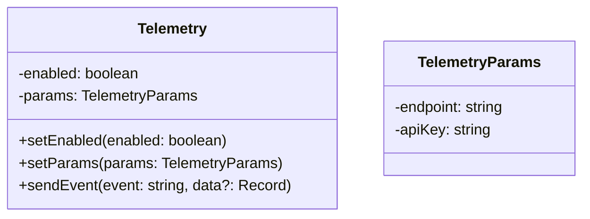
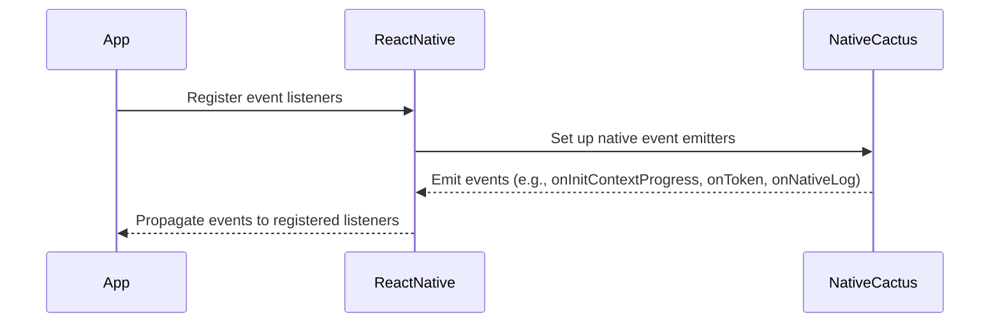

<details>
<summary>Relevant source files</summary>

The following files were used as context for generating this wiki page:

- [react-native/src/index.ts](https://github.com/agattani123/cactus/blob/main/react/src/index.ts)
- [react-native/src/NativeCactus.ts](https://github.com/agattani123/cactus/blob/main/react/src/NativeCactus.ts)
- [react-native/src/chat.ts](https://github.com/agattani123/cactus/blob/main/react/src/chat.ts)
- [react-native/src/tools.ts](https://github.com/agattani123/cactus/blob/main/react/src/tools.ts)
- [react-native/src/telemetry.ts](https://github.com/agattani123/cactus/blob/main/react/src/telemetry.ts)
</details>

# Extensibility and Customization

## Introduction

The Cactus project is a comprehensive solution that provides a native interface for interacting with large language models (LLMs) and leveraging their capabilities. It offers a range of features, including text completion, tokenization, embedding generation, and more. This wiki page focuses on the extensibility and customization aspects of the Cactus project, which allow developers to tailor the system to their specific needs and integrate additional functionalities.

Sources: [index.ts](), [NativeCactus.ts](), [chat.ts](), [tools.ts](), [telemetry.ts]()

The Cactus project provides a modular architecture that facilitates extensibility and customization. Developers can leverage various components and interfaces to enhance the system's capabilities or integrate it with other tools and services. The following sections will explore the key aspects of extensibility and customization within the Cactus project.

Sources: [index.ts](), [NativeCactus.ts](), [chat.ts](), [tools.ts](), [telemetry.ts]()

## Chat Formatting and Tools Integration

The Cactus project includes a `chat.ts` module that provides functionality for formatting chat conversations and integrating with external tools. This module defines types and functions that enable developers to work with chat messages in a format compatible with the OpenAI API, facilitating interoperability with other systems.

Sources: [chat.ts]()

### Chat Message Formatting

The `formatChat` function in the `chat.ts` module allows developers to format chat conversations into a standardized structure. This function takes an array of `CactusMessagePart` objects and returns a `JinjaFormattedChatResult` object, which can be used for rendering or further processing.

```typescript
export function formatChat(
  messages: CactusMessagePart[],
  options?: { maxTokens?: number }
): JinjaFormattedChatResult
```

Sources: [chat.ts:7-11]()

### Tools Integration

The `tools.ts` module provides functionality for integrating external tools with the Cactus project. It defines a `Tools` class that encapsulates various tools and their configurations, as well as a `parseAndExecuteTool` function for executing specific tools based on user input.



The `parseAndExecuteTool` function takes user input and attempts to match it against the registered tool parsers. If a match is found, the corresponding tool executor is called with the parsed parameters.

```typescript
export async function parseAndExecuteTool(
  input: string,
  tools: Tools
): Promise<string>
```

Sources: [tools.ts:7-44]()

## Telemetry and Analytics

The `telemetry.ts` module provides functionality for collecting and sending telemetry data, enabling developers to track usage metrics and gather insights about the Cactus project's performance and behavior.



The `Telemetry` class provides methods for enabling or disabling telemetry, setting the telemetry parameters (such as the endpoint and API key), and sending telemetry events with associated data.

```typescript
export class Telemetry {
  constructor(params: TelemetryParams)
  setEnabled(enabled: boolean)
  setParams(params: TelemetryParams)
  sendEvent(event: string, data?: Record<string, any>)
}
```

Sources: [telemetry.ts:7-32]()

## Native Integration and Event Handling

The Cactus project provides a native interface for interacting with LLMs and performing various operations, such as text completion, tokenization, and embedding generation. The `index.ts` module serves as the entry point for the React Native integration and handles native event handling and logging.

### Native Event Handling

The `index.ts` module sets up event listeners for various native events, such as context initialization progress, token generation, and native logging. These events are emitted by the native Cactus module and can be used to track the progress of operations or handle specific events within the application.



Sources: [index.ts:20-45]()

### Native Logging

The `index.ts` module also provides functionality for handling native logging. It defines an array of log listeners and sets up an event listener for the `EVENT_ON_NATIVE_LOG` event emitted by the native Cactus module. When a native log event is received, the registered log listeners are invoked with the log level and message.

```typescript
const logListeners: Array<(level: string, text: string) => void> = []

EventEmitter.addListener(
  EVENT_ON_NATIVE_LOG,
  (evt: { level: string; text: string }) => {
    logListeners.forEach((listener) => listener(evt.level, evt.text))
  }
)
```

Sources: [index.ts:38-45]()

## Conclusion

The Cactus project offers a range of extensibility and customization features that enable developers to tailor the system to their specific needs and integrate additional functionalities. The modular architecture, chat formatting, tools integration, telemetry and analytics, and native integration and event handling mechanisms provide a solid foundation for building custom applications and enhancing the capabilities of the Cactus project.

Sources: [index.ts](), [NativeCactus.ts](), [chat.ts](), [tools.ts](), [telemetry.ts]()