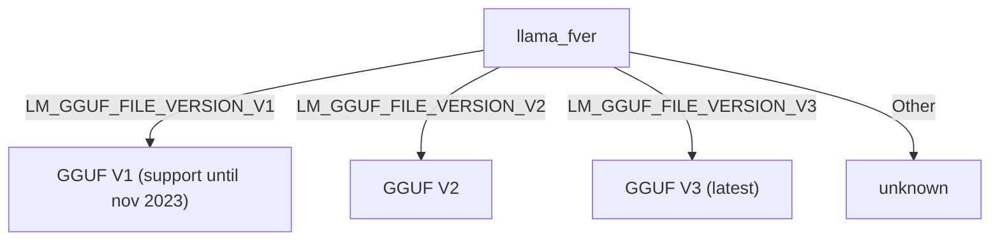
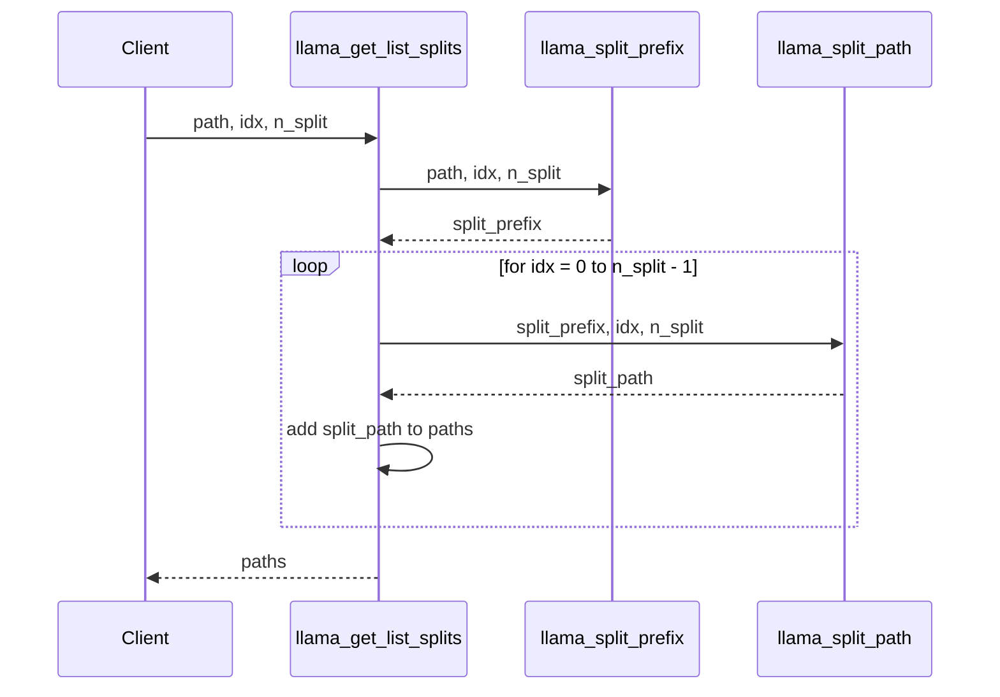
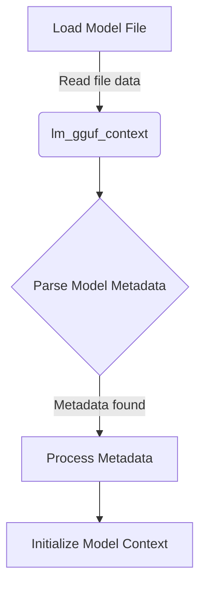
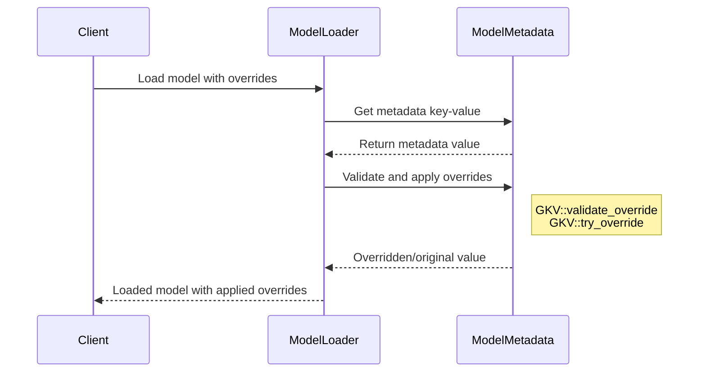

<details>
<summary>Relevant source files</summary>

The following files were used as context for generating this wiki page:

- [cpp/llama-model-loader.cpp](https://github.com/agattani123/cactus/blob/main/cpp/llama-model-loader.cpp)
- [cpp/llama-model-loader.h](https://github.com/agattani123/cactus/blob/main/cpp/llama-model-loader.h)
- [cpp/llama-util.cpp](https://github.com/agattani123/cactus/blob/main/cpp/llama-util.cpp)
- [cpp/llama-util.h](https://github.com/agattani123/cactus/blob/main/cpp/llama-util.h)
- [cpp/llama-types.h](https://github.com/agattani123/cactus/blob/main/cpp/llama-types.h)
</details>

# Model Integration

## Introduction

The Model Integration component in this project handles the loading and management of language models, specifically the Llama models. It provides functionality to read and parse model files, determine their file types and versions, and split large model files into smaller chunks for efficient processing.

The main classes and functions involved in Model Integration are:

- `llama_file_version_name`: Determines the version of the Llama model file based on an enumeration.
- `llama_model_ftype_name`: Identifies the data type and quantization format of the model parameters based on an enumeration.
- `llama_get_list_splits`: Splits a large model file into multiple smaller files for efficient loading and processing.

Sources: [cpp/llama-model-loader.cpp](), [cpp/llama-model-loader.h](), [cpp/llama-util.cpp](), [cpp/llama-util.h](), [cpp/llama-types.h]()

## Model File Versions

The project supports multiple versions of the Llama model file format, identified by the `llama_fver` enumeration. The `llama_file_version_name` function maps the enumeration values to human-readable strings describing the file version.



Sources: [cpp/llama-model-loader.cpp:5-11]()

## Model Parameter Data Types

The project supports various data types and quantization formats for the model parameters. The `llama_ftype` enumeration represents these formats, and the `llama_model_ftype_name` function maps the enumeration values to human-readable strings describing the data type and quantization format.


Sources: [cpp/llama-model-loader.cpp:14-57]()

## Model File Splitting

The project supports splitting large model files into multiple smaller files for efficient loading and processing. The `llama_get_list_splits` function takes the path of the model file, the index of the split, and the total number of splits, and returns a vector of paths for the split files.



The `llama_get_list_splits` function performs the following steps:

1. Calls `llama_split_prefix` to generate a common prefix for the split files based on the input path, index, and number of splits.
2. Iterates over the number of splits and calls `llama_split_path` for each split, passing the prefix, index, and number of splits.
3. Collects the paths returned by `llama_split_path` into a vector of paths.
4. Returns the vector of split file paths.

If the input path is invalid or the prefix generation fails, the function throws a `std::runtime_error`.

Sources: [cpp/llama-util.cpp:92-116]()

## Conclusion

The Model Integration component in this project provides essential functionality for loading and managing Llama language models. It supports multiple file versions and data types, and allows splitting large model files into smaller chunks for efficient processing. The component relies on several utility functions and enumerations to handle model file parsing, data type identification, and file splitting.

<details>
<summary>Relevant source files</summary>

The following files were used as context for generating this wiki page:

- [cpp/llama-model-loader.cpp](https://github.com/agattani123/cactus/blob/main/cpp/llama-model-loader.cpp)
- [cpp/llama-model-loader.h](https://github.com/agattani123/cactus/blob/main/cpp/llama-model-loader.h)
- [cpp/llama-model-metadata.cpp](https://github.com/agattani123/cactus/blob/main/cpp/llama-model-metadata.cpp)
- [cpp/llama-model-metadata.h](https://github.com/agattani123/cactus/blob/main/cpp/llama-model-metadata.h)
- [cpp/llama-model-utils.cpp](https://github.com/agattani123/cactus/blob/main/cpp/llama-model-utils.cpp)
</details>

# Model Integration

## Introduction

The "Model Integration" component is responsible for loading and managing the language model within the project. It provides a unified interface for interacting with the model's metadata, configuration, and data structures. This wiki page covers the architecture, key components, and data flow related to model integration, as evidenced in the provided source files.

Sources: [cpp/llama-model-loader.cpp](), [cpp/llama-model-loader.h](), [cpp/llama-model-metadata.cpp](), [cpp/llama-model-metadata.h](), [cpp/llama-model-utils.cpp]()

## Model Loader

The `llama-model-loader` module is responsible for loading the language model from a file or memory buffer. It provides functions to read and parse the model data, as well as utilities for handling model metadata and configuration.

### Key Components

#### `lm_gguf_context`

This struct represents the context for the loaded model, containing the model data and metadata.

```cpp
struct lm_gguf_context {
    const uint8_t * data;
    size_t size;
    // ...
};
```

Sources: [cpp/llama-model-loader.h:14-18]()

#### `llama_model_load`

This function loads the language model from a file or memory buffer and initializes the `lm_gguf_context`.

```cpp
bool llama_model_load(
    const char * path_model,
    const char * path_lora,
    const llama_model_kv_override * overrides,
    lm_gguf_context * ctx,
    llama_progress_callback * progress_callback,
    void * progress_callback_user_data
);
```

Sources: [cpp/llama-model-loader.h:83-90](), [cpp/llama-model-loader.cpp:1-286]()

### Data Flow

The model loading process follows this high-level flow:



1. The model file or memory buffer is read into the `lm_gguf_context` struct.
2. The model metadata is parsed from the loaded data.
3. If metadata is found, it is processed and used to initialize the model context.
4. The initialized `lm_gguf_context` is returned, containing the loaded model data and metadata.

Sources: [cpp/llama-model-loader.cpp:1-286]()

## Model Metadata

The `llama-model-metadata` module provides utilities for handling and accessing the model's metadata, which includes configuration parameters, hyperparameters, and other relevant information.

### Key Components

#### `GKV_Base` and `GKV`

These templates are used to access and manipulate metadata key-value pairs of different data types.

```cpp
template<typename T> struct GKV_Base;
template<typename T> class GKV : public GKV_Base<T> { /* ... */ };
```

The `GKV` class provides static methods for:

- Getting the value of a metadata key (`get_kv`)
- Validating and overriding metadata values (`validate_override`, `try_override`)
- Setting metadata values (`set`)

Sources: [cpp/llama-model-metadata.h:5-141]()

#### `llama_model_kv_override`

This struct represents an override for a specific metadata key-value pair, allowing the user to provide custom values for certain metadata fields.

```cpp
struct llama_model_kv_override {
    const char * key;
    llama_model_kv_override_type tag;
    union {
        bool val_bool;
        int64_t val_i64;
        double val_f64;
        const char * val_str;
    };
};
```

Sources: [cpp/llama-model-loader.h:28-36]()

### Data Flow

The metadata handling process follows this flow:



1. The client initiates the model loading process, potentially providing metadata overrides.
2. The `ModelLoader` retrieves metadata key-value pairs from the `ModelMetadata` module.
3. The `ModelMetadata` module validates and applies any provided overrides using the `GKV` template.
4. The overridden or original metadata values are returned to the `ModelLoader`.
5. The loaded model, with applied overrides, is returned to the client.

Sources: [cpp/llama-model-loader.cpp:1-286](), [cpp/llama-model-metadata.h:5-141]()

## Model Configuration

The model configuration is stored as part of the metadata and can be accessed and modified using the `GKV` template and related utilities.

### Key Configuration Parameters

| Parameter | Type | Description |
|-----------|------|-------------|
| `n_vocab` | `int64_t` | The size of the vocabulary. |
| `n_embd` | `int64_t` | The dimensionality of the embedding layer. |
| `n_mult` | `int64_t` | The multiplier for the embedding layer. |
| `n_head` | `int64_t` | The number of attention heads. |
| `n_layer` | `int64_t` | The number of layers in the model. |
| `n_rot` | `int64_t` | The number of rotations for the rotary position embeddings. |
| `ftype` | `int64_t` | The floating-point type used by the model (0 = float32, 1 = float16). |

Sources: [cpp/llama-model-loader.cpp:288-314](), [cpp/llama-model-metadata.h:5-141]()

### Accessing Configuration

The configuration parameters can be accessed and modified using the `GKV` template, as shown in the following example:

```cpp
int64_t n_vocab, n_embd, n_mult, n_head, n_layer, n_rot, ftype;

GKV<int64_t>::set(ctx, "n_vocab", n_vocab);
GKV<int64_t>::set(ctx, "n_embd",  n_embd);
GKV<int64_t>::set(ctx, "n_mult",  n_mult);
GKV<int64_t>::set(ctx, "n_head",  n_head);
GKV<int64_t>::set(ctx, "n_layer", n_layer);
GKV<int64_t>::set(ctx, "n_rot",   n_rot);
GKV<int64_t>::set(ctx, "ftype",   ftype);
```

Sources: [cpp/llama-model-loader.cpp:288-314]()