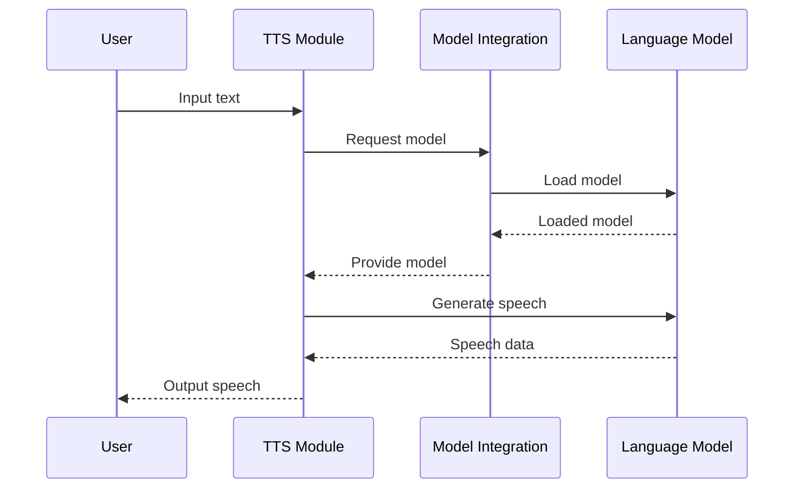

<details>
<summary>Relevant source files</summary>

The following files were used as context for generating this wiki page:

- [cpp/llama-model-loader.cpp](https://github.com/agattani123/cactus/blob/main/cpp/llama-model-loader.cpp)
- [cpp/cactus_tts.cpp](https://github.com/agattani123/cactus/blob/main/cpp/cactus_tts.cpp)
- [cpp/llama.cpp](https://github.com/agattani123/cactus/blob/main/cpp/llama.cpp)
- [cpp/llama-util.cpp](https://github.com/agattani123/cactus/blob/main/cpp/llama-util.cpp)
- [cpp/llama-types.h](https://github.com/agattani123/cactus/blob/main/cpp/llama-types.h)

</details>

# Model Integration

## Introduction

Model Integration is a crucial component of the project, responsible for loading and managing the language models used for various tasks, such as text generation, translation, and speech synthesis. It provides a unified interface for handling different model formats, data types, and quantization levels, ensuring seamless integration and efficient utilization of the models within the project's codebase.

Sources: [cpp/llama-model-loader.cpp](), [cpp/cactus_tts.cpp](), [cpp/llama.cpp](), [cpp/llama-util.cpp](), [cpp/llama-types.h]()

## Model Formats and Versions

The project supports multiple model file formats and versions, each with its own characteristics and capabilities. The supported formats and versions are listed below:

### GGUF (General Generative Universal Format)

GGUF is the primary model file format used in the project. It supports three versions:

1. **GGUF V1**: The initial version, with support until November 2023.
2. **GGUF V2**: An updated version with improvements and bug fixes.
3. **GGUF V3**: The latest version, incorporating additional features and optimizations.

```cpp
const char * llama_file_version_name(llama_fver version) {
    switch (version) {
        case LM_GGUF_FILE_VERSION_V1: return "GGUF V1 (support until nov 2023)";
        case LM_GGUF_FILE_VERSION_V2: return "GGUF V2";
        case LM_GGUF_FILE_VERSION_V3: return "GGUF V3 (latest)";
    }

    return "unknown";
}
```

Sources: [cpp/llama-model-loader.cpp:10-17]()

## Model Data Types and Quantization

The project supports various data types and quantization levels for model parameters, allowing for efficient storage and computation. The supported data types and quantization levels are listed below:

```mermaid
graph TD
    A[Model Data Types] --> B[Float32]
    A --> C[Float16]
    A --> D[BFloat16]
    A --> E[Quantized Types]
    E --> F[Q4_0]
    E --> G[Q4_1]
    E --> H[Q5_0]
    E --> I[Q5_1]
    E --> J[Q8_0]
    E --> K[Q2_K]
    K --> L[Q2_K - Medium]
    K --> M[Q2_K - Small]
    E --> N[Q3_K]
    N --> O[Q3_K - Small]
    N --> P[Q3_K - Medium]
    N --> Q[Q3_K - Large]
    E --> R[Q4_K]
    R --> S[Q4_K - Small]
    R --> T[Q4_K - Medium]
    E --> U[Q5_K]
    U --> V[Q5_K - Small]
    U --> W[Q5_K - Medium]
    E --> X[Q6_K]
    E --> Y[Ternary Quantized]
    Y --> Z[TQ1_0]
    Y --> AA[TQ2_0]
    E --> AB[Integer Quantized]
    AB --> AC[IQ2_XXS]
    AB --> AD[IQ2_XS]
    AB --> AE[IQ2_S]
    AB --> AF[IQ2_M]
    AB --> AG[IQ3_XS]
    AB --> AH[IQ3_XXS]
    AB --> AI[IQ1_S]
    AB --> AJ[IQ1_M]
    AB --> AK[IQ4_NL]
    AB --> AL[IQ4_XS]
    AB --> AM[IQ3_S]
    AB --> AN[IQ3_M]
```



The data type and quantization level of a model are determined during the loading process and can be identified using the `llama_model_ftype_name` function.

```cpp
static std::string llama_model_ftype_name(llama_ftype ftype) {
    // ... (implementation omitted for brevity)
}
```

Sources: [cpp/llama-model-loader.cpp:19-87](), [cpp/llama-types.h]()

## Model Loading and Splitting

The project supports loading models from a single file or from multiple split files. The `llama_get_list_splits` function is responsible for handling split model files.

```cpp
static std::vector<std::string> llama_get_list_splits(const std::string & path, const int idx, const int n_split) {
    std::vector<std::string> paths;
    std::string split_prefix;
    std::vector<char> buf(llama_path_max(), 0);

    // ... (implementation omitted for brevity)

    return paths;
}
```

This function takes the path to the model file, the index of the split file, and the total number of split files. It returns a vector of paths to the individual split files, which can be used for loading the model in parallel or sequentially.

Sources: [cpp/llama-model-loader.cpp:89-115]()

## Model Integration in Text-to-Speech (TTS)

The Model Integration component plays a crucial role in the Text-to-Speech (TTS) functionality of the project. The `cactus_tts` module utilizes the loaded language models to generate speech from input text.



The TTS module interacts with the Model Integration component to request and obtain the appropriate language model for speech generation. Once the model is loaded, the TTS module utilizes it to convert the input text into speech data, which is then returned to the user.

Sources: [cpp/cactus_tts.cpp](), [cpp/llama-model-loader.cpp]()

## Conclusion

Model Integration is a critical component of the project, enabling the seamless integration and utilization of language models for various tasks, such as text generation, translation, and speech synthesis. It provides a unified interface for handling different model formats, data types, and quantization levels, ensuring efficient storage and computation. The project supports multiple model file formats, including GGUF, and offers a range of data types and quantization levels for model parameters. Additionally, Model Integration facilitates the loading of models from single or split files, enabling parallel or sequential loading as needed. Overall, this component plays a vital role in the project's functionality, ensuring the effective utilization of language models across various modules and applications.

<details>
<summary>Relevant source files</summary>

The following files were used as context for generating this wiki page:

- [cpp/llama-model-loader.cpp](https://github.com/agattani123/cactus/blob/main/cpp/llama-model-loader.cpp)
</details>

# Model Integration

## Introduction

The "Model Integration" functionality within this project revolves around the `GGUFMeta` namespace, which provides a set of utilities for working with the GGUF (General Generative Universal Format) metadata format. This format is used to represent and access various types of data, such as boolean, integer, floating-point, string, and array values, associated with a model or other context.

The primary purpose of the `GGUFMeta` namespace is to facilitate the loading and handling of model metadata, which may include configuration parameters, hyperparameters, or other relevant information required for model initialization, training, or inference. The namespace defines several templates and helper functions to simplify the process of retrieving and validating metadata values from a GGUF context.

Sources: [cpp/llama-model-loader.cpp]()

## Key Components

### `GKV_Base_Type` Template

The `GKV_Base_Type` template serves as a base for defining type-specific metadata getters. It associates a given data type `T` with the corresponding `lm_gguf_type` enumeration value and provides a static `getter` function that retrieves a value of type `T` from a `lm_gguf_context` using the appropriate `lm_gguf_get_val_*` function.

Sources: [cpp/llama-model-loader.cpp:5-15]()

### `GKV_Base` Struct

The `GKV_Base` struct is a type-specific specialization of the `GKV_Base_Type` template for various data types, such as `bool`, `uint8_t`, `int32_t`, `float`, `double`, `const char*`, and `std::string`. It defines the `gt` (GGUF type) and `getter` function for each supported type.

Sources: [cpp/llama-model-loader.cpp:17-34]()

### `ArrayInfo` Struct

The `ArrayInfo` struct represents information about an array in the GGUF context. It contains the GGUF type of the array elements (`gt`), the length of the array (`length`), and a pointer to the array data (`data`).

Sources: [cpp/llama-model-loader.cpp:36-42]()

### `GKV` Class Template

The `GKV` class template is the main entry point for working with GGUF metadata. It inherits from the `GKV_Base` struct for the specified data type `T` and provides several static methods for retrieving and validating metadata values:

- `get_kv`: Retrieves a metadata value of type `T` from the GGUF context, ensuring that the key's type matches the expected type.
- `override_type_to_str`: Helper function that converts a `llama_model_kv_override_type` enum value to a string representation.
- `validate_override`: Validates a `llama_model_kv_override` struct against the expected type and logs information about the override.
- `try_override`: Attempts to apply a `llama_model_kv_override` to a target variable of type `T`, if the override type matches the expected type.
- `set`: Retrieves a metadata value of type `T` from the GGUF context, either by key index or key string, and optionally applies a `llama_model_kv_override` if provided.

Sources: [cpp/llama-model-loader.cpp:44-143]()

## Data Flow

The typical data flow for working with GGUF metadata using the `GGUFMeta` namespace involves the following steps:

1. Obtain a `lm_gguf_context` representing the GGUF metadata.
2. Create a target variable of the desired data type (`bool`, `int32_t`, `std::string`, etc.).
3. Optionally, create a `llama_model_kv_override` struct to override the metadata value.
4. Call the `GKV<T>::set` function, providing the `lm_gguf_context`, the key (index or string), the target variable reference, and the optional `llama_model_kv_override`.
5. The `set` function will attempt to apply the override (if provided) or retrieve the value from the GGUF context and store it in the target variable.

```mermaid
flowchart TD
    subgraph Data Flow
        A[Obtain lm_gguf_context] -->|metadata| B[Create target variable]
        C[Create llama_model_kv_override (optional)]
        B --> D[Call GKV<T>::set]
        C ---> D
        D -->|override applied or value retrieved| E[Target variable updated]
    end
```

Sources: [cpp/llama-model-loader.cpp]()

## Key Functions

### `GKV<T>::get_kv`

```cpp
static T get_kv(const lm_gguf_context * ctx, const int k)
```

Retrieves a metadata value of type `T` from the GGUF context at the specified key index `k`. It checks if the key's type matches the expected type (`GKV::gt`) and throws an exception if they don't match. If the types match, it calls the `GKV::getter` function to retrieve the value.

Sources: [cpp/llama-model-loader.cpp:54-62]()

### `GKV<T>::set`

```cpp
static bool set(const lm_gguf_context * ctx, const int k, T & target, const struct llama_model_kv_override * ovrd = nullptr)
static bool set(const lm_gguf_context * ctx, const char * key, T & target, const struct llama_model_kv_override * ovrd = nullptr)
static bool set(const lm_gguf_context * ctx, const std::string & key, T & target, const struct llama_model_kv_override * ovrd = nullptr)
```

Retrieves a metadata value of type `T` from the GGUF context and stores it in the `target` variable. It supports three overloads:

1. Retrieves the value by key index `k`.
2. Retrieves the value by key string `key`.
3. Retrieves the value by key string `key` (using `std::string`).

Before retrieving the value, it attempts to apply a `llama_model_kv_override` (if provided) by calling the `try_override` function. If the override is successful, it stores the overridden value in `target` and returns `true`. Otherwise, it retrieves the value from the GGUF context using `get_kv` and stores it in `target`.

Sources: [cpp/llama-model-loader.cpp:137-143]()

## Sequence Diagram

The following sequence diagram illustrates the interaction between the `GKV` class template and the GGUF context when retrieving a metadata value with an optional override:

```mermaid
sequenceDiagram
    participant Client
    participant GKV<T>
    participant GKV_Base<T>
    participant lm_gguf_context

    Client->>GKV<T>: set(ctx, key, target, override)
    GKV<T>->>GKV<T>: try_override(target, override)
    GKV<T>->>GKV<T>: validate_override(override)
    GKV<T>-->>Client: Log override info
    opt Override not applied
        GKV<T>->>GKV_Base<T>: get_kv(ctx, key)
        GKV_Base<T>->>lm_gguf_context: lm_gguf_get_kv_type(ctx, key)
        lm_gguf_context-->>GKV_Base<T>: Key type
        GKV_Base<T>->>lm_gguf_context: lm_gguf_get_val_*(ctx, key)
        lm_gguf_context-->>GKV_Base<T>: Value
        GKV_Base<T>-->>GKV<T>: Value
        GKV<T>-->>Client: Value stored in target
    end
    Client-->>GKV<T>: Success/Failure
```

This diagram shows the following steps:

1. The client calls `GKV<T>::set` with the GGUF context, key, target variable, and optional override.
2. `GKV<T>` attempts to apply the override by calling `try_override`.
3. `try_override` validates the override type by calling `validate_override`.
4. If the override is valid, its information is logged to the client.
5. If the override is not applied, `GKV<T>` retrieves the value from the GGUF context:
   a. It calls `GKV_Base<T>::get_kv`, which retrieves the key type from the GGUF context.
   b. If the key type matches the expected type, `get_kv` calls the appropriate `lm_gguf_get_val_*` function to retrieve the value.
   c. The retrieved value is returned to `GKV<T>` and stored in the target variable.
6. The success or failure status is returned to the client.

Sources: [cpp/llama-model-loader.cpp]()

## Configuration Options

The `GGUFMeta` namespace does not appear to have any explicit configuration options. However, it relies on the underlying GGUF format and the `lm_gguf_context` structure, which may have its own configuration or initialization requirements.