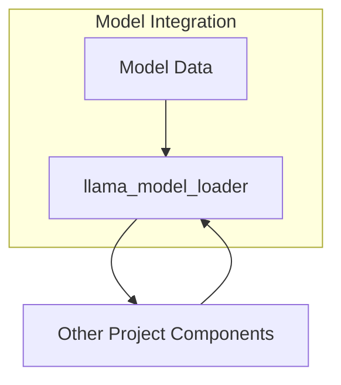
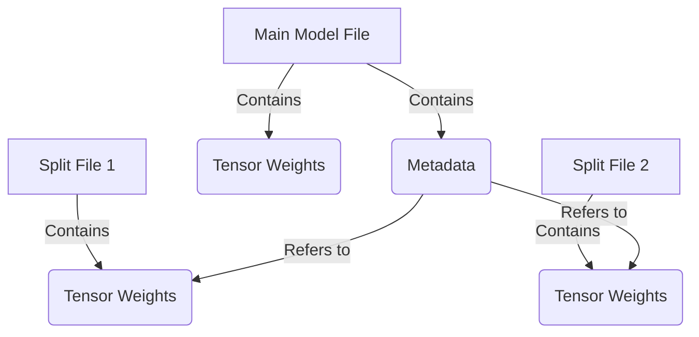
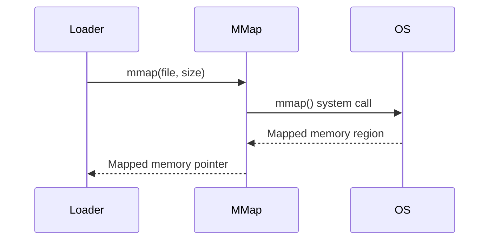
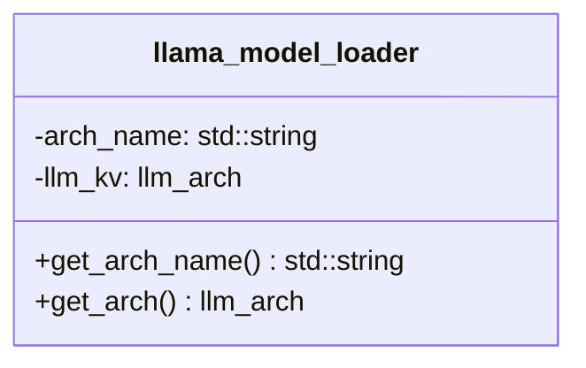

## Conclusion

The "Model Integration" component provides a robust and extensible framework for loading, managing, and configuring the language model within the project. It offers a unified interface for accessing model metadata, applying overrides, and retrieving configuration parameters. The modular design and extensive use of templates and utilities ensure code reusability and maintainability.

<details>
<summary>Relevant source files</summary>

The following files were used as context for generating this wiki page:

- [cpp/llama-model-loader.cpp](https://github.com/agattani123/cactus/blob/main/cpp/llama-model-loader.cpp)
- [cpp/llama-model-loader.h](https://github.com/agattani123/cactus/blob/main/cpp/llama-model-loader.h)
</details>

# Model Integration

## Introduction

The "Model Integration" functionality within the project revolves around loading and accessing data from a model file. It provides a set of utility functions and methods to retrieve various types of data, such as arrays, key-value pairs, and configuration parameters, from the model file. This functionality is encapsulated within the `llama_model_loader` class, which serves as an interface for interacting with the model data.

The primary purpose of "Model Integration" is to facilitate the loading and parsing of model data, enabling other components of the project to access and utilize this information as needed. It abstracts away the low-level details of reading and interpreting the model file format, providing a convenient and consistent API for accessing the required data.

Sources: [cpp/llama-model-loader.cpp](), [cpp/llama-model-loader.h]()

## Model Data Retrieval

The `llama_model_loader` class provides several template functions for retrieving different types of data from the model file. These functions handle various scenarios, such as retrieving scalar values, arrays, and key-value pairs.

### Retrieving Array Length

The `get_arr_n` function retrieves the length of an array stored in the model file. It takes the key (or an enumeration value) representing the array and a reference to a variable to store the length. If the key is not found or an error occurs, an exception is thrown.

```cpp
template<typename T>
bool get_arr_n(const std::string& key, T& result, bool required);

template<typename T>
bool get_arr_n(enum llm_kv kid, T& result, bool required);
```

Sources: [cpp/llama-model-loader.cpp:8-26](), [cpp/llama-model-loader.cpp:28-32]()

### Retrieving Arrays

The `get_arr` function retrieves an array of values from the model file. It takes the key (or an enumeration value) representing the array and a reference to a vector or an array to store the retrieved values. If the key is not found or an error occurs, an exception is thrown.

```cpp
template<typename T>
bool get_arr(const std::string& key, std::vector<T>& result, bool required);

template<typename T, size_t N_MAX>
bool get_arr(const std::string& key, std::array<T, N_MAX>& result, bool required);

template<typename T>
bool get_arr(enum llm_kv kid, T& result, bool required);
```

Sources: [cpp/llama-model-loader.cpp:34-71](), [cpp/llama-model-loader.cpp:73-112](), [cpp/llama-model-loader.cpp:114-118]()

### Retrieving Key-Value Pairs

The `get_key` function retrieves a scalar value associated with a key from the model file. It takes the key (or an enumeration value) and a reference to a variable to store the retrieved value. If the key is not found or an error occurs, an exception is thrown.

```cpp
template<typename T>
bool get_key(const std::string& key, T& result, bool required);

template<typename T>
bool get_key(enum llm_kv kid, T& result, bool required);
```

Sources: [cpp/llama-model-loader.cpp:120-135](), [cpp/llama-model-loader.cpp:137-141]()

There is also a specialized implementation of `get_key` for retrieving values of the `llama_pooling_type` enumeration.

```cpp
template<>
bool get_key(enum llm_kv kid, enum llama_pooling_type& result, bool required);
```

Sources: [cpp/llama-model-loader.cpp:143-153]()

### Retrieving Key-Value Pairs or Arrays

The `get_key_or_arr` function retrieves either a scalar value or an array of values associated with a key from the model file. It takes the key (or an enumeration value), a reference to an array to store the retrieved values, the expected length of the array, and a flag indicating whether the key is required. If the key is not found, the array has an incorrect length, or an error occurs, an exception is thrown.

```cpp
template<typename T, size_t N_MAX>
bool get_key_or_arr(const std::string& key, std::array<T, N_MAX>& result, uint32_t n, bool required);

template<typename T>
bool get_key_or_arr(enum llm_kv kid, T& result, uint32_t n, bool required);
```

Sources: [cpp/llama-model-loader.cpp:155-185](), [cpp/llama-model-loader.cpp:187-191]()

## Data Flow Diagram

The following diagram illustrates the high-level data flow and interactions between the `llama_model_loader` class and other components of the project:



The `llama_model_loader` class acts as an intermediary between the model data and other components of the project. It reads and parses the model data, providing an interface for other components to retrieve the required information.

Sources: [cpp/llama-model-loader.cpp](), [cpp/llama-model-loader.h]()

## Key Features and Components

| Feature/Component | Description |
| ------------------ | ----------- |
| `llama_model_loader` class | The main class responsible for loading and providing access to model data. |
| `get_arr_n` | Retrieves the length of an array stored in the model file. |
| `get_arr` | Retrieves an array of values from the model file. |
| `get_key` | Retrieves a scalar value associated with a key from the model file. |
| `get_key_or_arr` | Retrieves either a scalar value or an array of values associated with a key from the model file. |

Sources: [cpp/llama-model-loader.cpp](), [cpp/llama-model-loader.h]()

## Conclusion

The "Model Integration" functionality within the project provides a convenient and consistent interface for loading and accessing data from a model file. It abstracts away the low-level details of reading and interpreting the model file format, allowing other components of the project to easily retrieve the required information. The `llama_model_loader` class serves as the central component for this functionality, offering a range of template functions to handle various data retrieval scenarios, such as retrieving scalar values, arrays, and key-value pairs.

Sources: [cpp/llama-model-loader.cpp](), [cpp/llama-model-loader.h]()

<details>
<summary>Relevant source files</summary>

The following files were used as context for generating this wiki page:

- [cpp/llama-model-loader.cpp](https://github.com/agattani123/cactus/blob/main/cpp/llama-model-loader.cpp)
- [cpp/llama-model-loader.h](https://github.com/agattani123/cactus/blob/main/cpp/llama-model-loader.h)
- [cpp/llama-mmap.cpp](https://github.com/agattani123/cactus/blob/main/cpp/llama-mmap.cpp)
- [cpp/llama-mmap.h](https://github.com/agattani123/cactus/blob/main/cpp/llama-mmap.h)
- [cpp/llama-util.cpp](https://github.com/agattani123/cactus/blob/main/cpp/llama-util.cpp)
- [cpp/llama-util.h](https://github.com/agattani123/cactus/blob/main/cpp/llama-util.h)

</details>

# Model Integration

## Introduction

The "Model Integration" component in this project is responsible for loading and managing the underlying language model used for various natural language processing tasks. It provides a unified interface for accessing and manipulating the model data, including loading model files, handling tensor weights, and exposing key-value metadata.

The primary class involved in this process is `llama_model_loader`, which encapsulates the logic for loading and initializing the language model from one or more model files. It supports loading models split across multiple files and handles various data types and quantization formats used for storing tensor weights.

Sources: [cpp/llama-model-loader.cpp](), [cpp/llama-model-loader.h]()

## Model Loading

The `llama_model_loader` class is initialized with the path to the main model file and an optional list of split files. It supports loading models in both memory-mapped and non-memory-mapped modes, depending on the platform's capabilities and user preferences.

```cpp
llama_model_loader::llama_model_loader(
        const std::string & fname,
        std::vector<std::string> & splits,
        bool use_mmap,
        bool check_tensors,
        const llama_model_kv_override * param_overrides_p,
        const llama_model_tensor_buft_override * param_tensor_buft_overrides_p)
```

The class loads the model metadata and tensor weights from the provided files, handling various quantization formats and data types. It also supports overriding key-value pairs and tensor buffers through external configurations.

Sources: [cpp/llama-model-loader.cpp:23-282]()

### Model File Structure

The model files follow the GGML (General Generative Modeling Language) format, which stores the model metadata and tensor weights in a structured manner. The main file contains the primary metadata and tensor weights, while additional split files can be used to distribute the model across multiple files.



The `llama_model_loader` class handles the loading and integration of tensor weights from multiple split files, ensuring a unified representation of the model data.

Sources: [cpp/llama-model-loader.cpp:133-195]()

## Key-Value Metadata

The model files also store key-value metadata, which provides additional information about the model architecture, quantization formats, and other configuration parameters. The `llama_model_loader` class exposes methods for accessing and overriding this metadata.

```cpp
void get_key(const std::string & key, std::string & value, bool throw_on_missing = true) const;
void get_key(const std::string & key, int & value, bool throw_on_missing = true) const;
void get_key(const std::string & key, uint16_t & value, bool throw_on_missing = true) const;
```

These methods allow retrieving the value associated with a specific key from the model metadata. If the key is not found and `throw_on_missing` is set to `true`, an exception is thrown.

Sources: [cpp/llama-model-loader.cpp:283-304](), [cpp/llama-model-loader.h:53-55]()

## Tensor Weight Management

The `llama_model_loader` class maintains a map of tensor weights, indexed by their names. This map is populated during the model loading process and can be accessed through the `get_tensor_weight` method.

```cpp
const llama_tensor_weight & get_tensor_weight(const std::string & name) const;
```

This method retrieves the `llama_tensor_weight` object associated with the given tensor name, which encapsulates the tensor data, quantization format, and other relevant information.

Sources: [cpp/llama-model-loader.cpp:306-310](), [cpp/llama-model-loader.h:57-58]()

## Memory Mapping

The `llama_model_loader` class supports loading tensor weights into memory using memory mapping, which can improve performance by reducing disk I/O operations. The `llama_mmap` class provides a platform-independent interface for memory mapping files.



The memory mapping functionality is enabled by default if supported by the underlying platform. However, it can be disabled by passing `use_mmap=false` to the `llama_model_loader` constructor.

Sources: [cpp/llama-mmap.cpp](), [cpp/llama-mmap.h]()

## Utility Functions

The project also includes various utility functions and classes that support the model integration process, such as string formatting, tensor shape formatting, and file handling.

```cpp
std::string format(const char * fmt, ...);
std::string llama_format_tensor_shape(const lm_ggml_tensor * tensor);
```

These utility functions are used throughout the codebase to facilitate common operations and improve code readability and maintainability.

Sources: [cpp/llama-util.cpp](), [cpp/llama-util.h]()

## Conclusion

The "Model Integration" component in this project provides a robust and flexible solution for loading and managing language models in various formats and configurations. It handles model splitting, tensor weight quantization, key-value metadata management, and memory mapping for performance optimization. By encapsulating these functionalities within the `llama_model_loader` class and its supporting classes and utilities, the project ensures a consistent and efficient approach to model integration across different use cases and applications.

<details>
<summary>Relevant source files</summary>

The following files were used as context for generating this wiki page:

- [cpp/llama-model-loader.cpp](https://github.com/agattani123/cactus/blob/main/cpp/llama-model-loader.cpp)
- [cpp/llama-model-loader.h](https://github.com/agattani123/cactus/blob/main/cpp/llama-model-loader.h)

</details>

# Model Integration

## Introduction

The "Model Integration" component within the project is responsible for loading and managing the underlying language model architecture. It provides an abstraction layer for interacting with the model, allowing other parts of the system to access and utilize the model's capabilities without directly dealing with the low-level implementation details.

Sources: [cpp/llama-model-loader.h](), [cpp/llama-model-loader.cpp]()

## Model Loader Class

The `llama_model_loader` class serves as the primary interface for loading and accessing the language model. It encapsulates the model architecture and provides methods for retrieving information about the loaded model.

### Class Definition



The `llama_model_loader` class has the following members:

- `arch_name`: A string representing the name of the loaded model architecture.
- `llm_kv`: An instance of the `llm_arch` enum, which holds the specific architecture of the loaded model.
- `get_arch_name()`: A method that returns the name of the loaded model architecture as a string.
- `get_arch()`: A method that returns the loaded model architecture as an `llm_arch` enum value.
