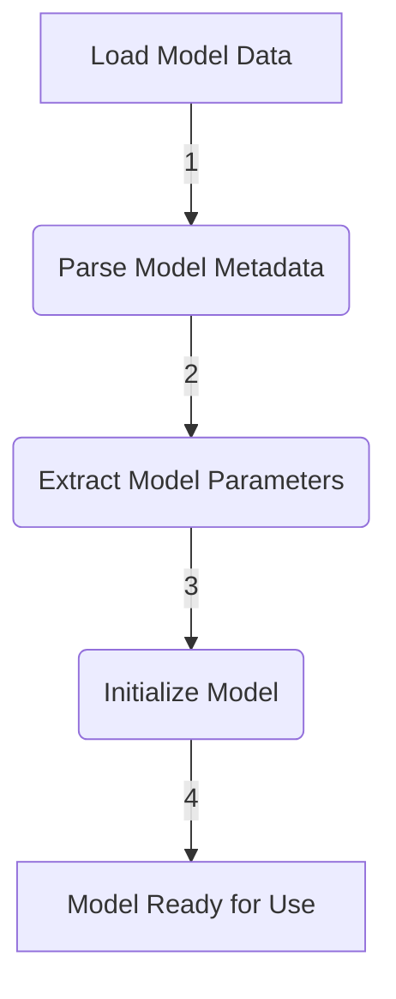
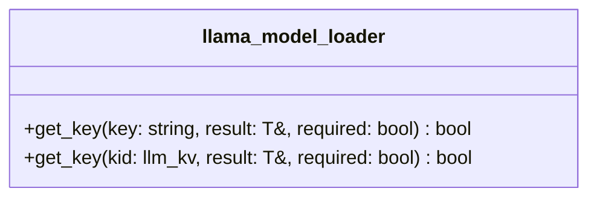
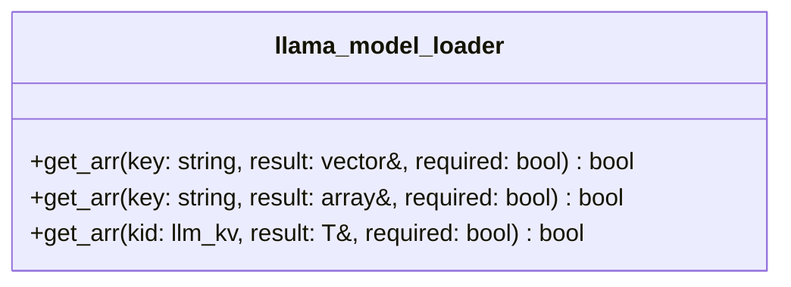
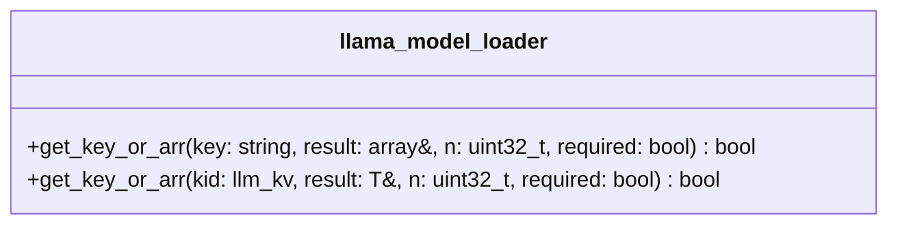
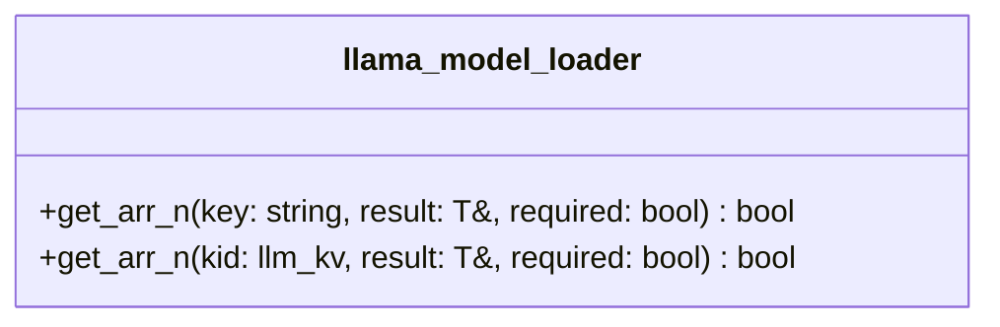
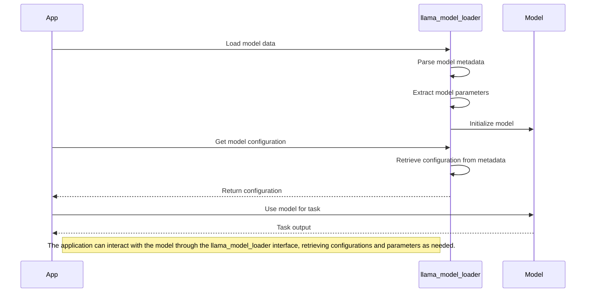
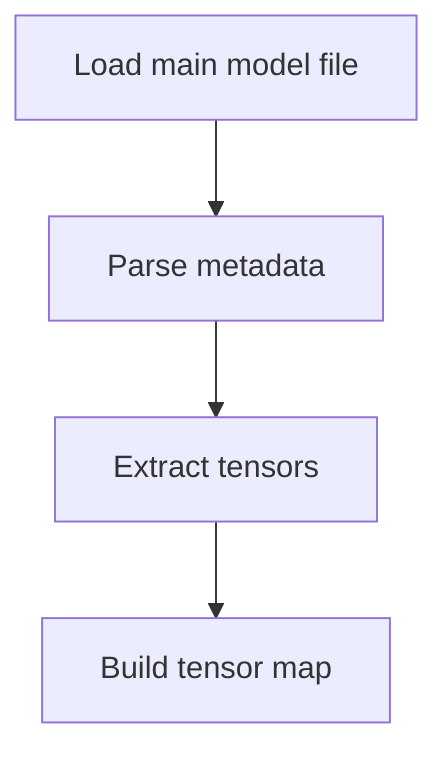
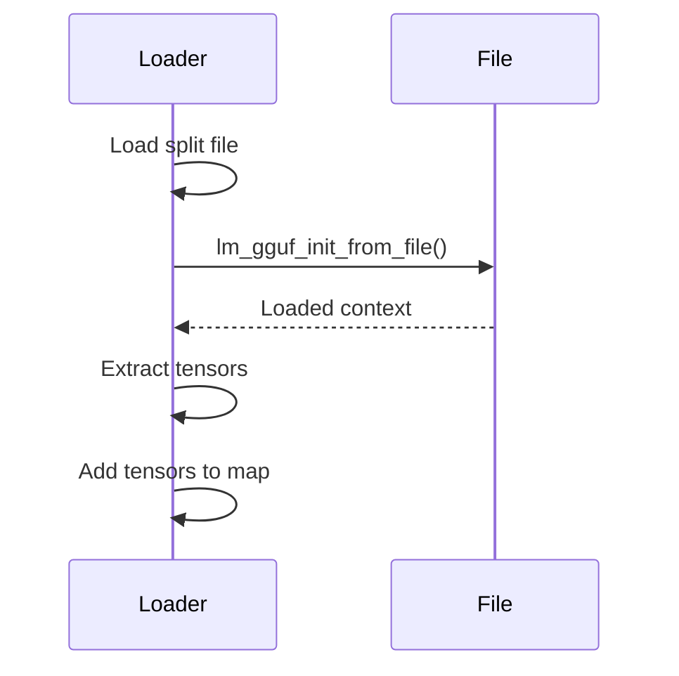
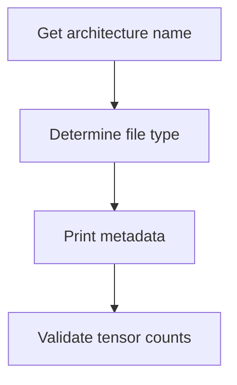
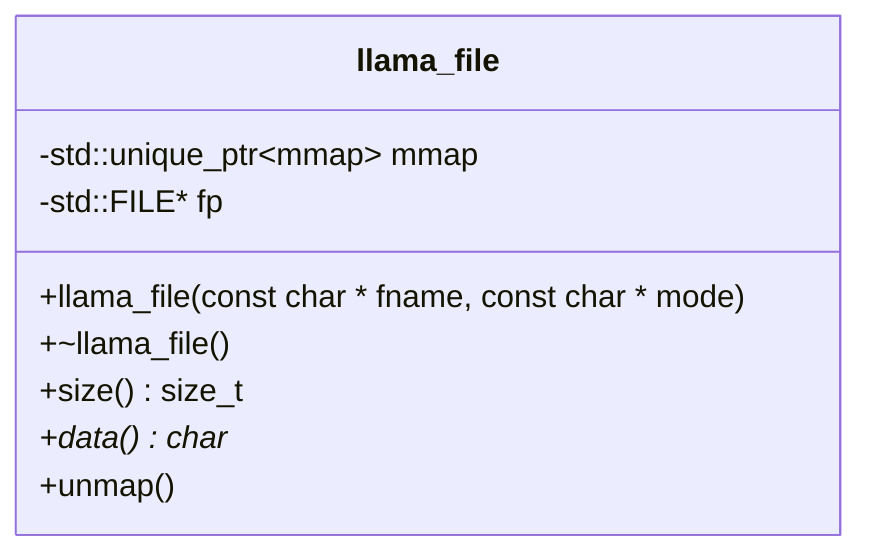

## Data Model

The `GGUFMeta` namespace primarily deals with the following data types:

| Type | Description |
|------|-------------|
| `bool` | Boolean value |
| `uint8_t` | Unsigned 8-bit integer |
| `uint16_t` | Unsigned 16-bit integer |
| `uint32_t` | Unsigned 32-bit integer |
| `uint64_t` | Unsigned 64-bit integer |
| `int8_t` | Signed 8-bit integer |
| `int16_t` | Signed 16-bit integer |
| `int32_t` | Signed 32-bit integer |
| `int64_t` | Signed 64-bit integer |
| `float` | 32-bit floating-point value |
| `double` | 64-bit floating-point value |
| `const char*` | Null-terminated string |
| `std::string` | Standard C++ string |
| `ArrayInfo` | Struct containing information about an array (type, length, data pointer) |

These types are used to represent and retrieve metadata values from the GGUF context.

Sources: [cpp/llama-model-loader.cpp]()

## Conclusion

The `GGUFMeta` namespace provides a convenient and type-safe way to interact with GGUF metadata within the project. It abstracts away the low-level details of working with the GGUF format and offers a unified interface for retrieving and validating metadata values of various data types. By leveraging templates and helper functions, the namespace simplifies the process of handling metadata, allowing developers to focus on the higher-level logic of model integration and configuration.

<details>
<summary>Relevant source files</summary>

The following files were used as context for generating this wiki page:

- [cpp/llama-model-loader.cpp](https://github.com/agattani123/cactus/blob/main/cpp/llama-model-loader.cpp)
- [cpp/cactus_tts.cpp](https://github.com/agattani123/cactus/blob/main/cpp/cactus_tts.cpp)
- [cpp/llama-model-loader.h](https://github.com/agattani123/cactus/blob/main/cpp/llama-model-loader.h)
- [cpp/llama-model-loader-utils.h](https://github.com/agattani123/cactus/blob/main/cpp/llama-model-loader-utils.h)
- [cpp/llama-model-loader-utils.cpp](https://github.com/agattani123/cactus/blob/main/cpp/llama-model-loader-utils.cpp)

</details>

# Model Integration

## Introduction

The "Model Integration" component in this project is responsible for loading and managing the machine learning models used for various tasks, such as text generation, speech synthesis, and potentially other applications. It provides a unified interface for accessing and configuring the models, abstracting away the low-level details of model loading and data manipulation.

The core functionality of Model Integration is implemented in the `llama_model_loader` class, which encapsulates the logic for loading and interacting with the models. It supports loading models from various formats, such as the GGUF (Generalized Graphical Universal Format) format, and provides methods for retrieving model parameters, configurations, and other metadata.

Sources: [cpp/llama-model-loader.h](), [cpp/llama-model-loader.cpp]()

## Model Loading and Initialization

The `llama_model_loader` class provides methods for loading and initializing the machine learning models. The loading process involves parsing the model data, extracting relevant information, and preparing the model for use.



The model loading process can be summarized as follows:

1. **Load Model Data**: The raw model data is loaded from a file or other data source.
2. **Parse Model Metadata**: The metadata associated with the model is parsed and stored in an internal data structure (`GGUFMeta`).
3. **Extract Model Parameters**: The model parameters, such as weights, biases, and configurations, are extracted from the metadata.
4. **Initialize Model**: The model is initialized using the extracted parameters and prepared for use in various tasks.

Sources: [cpp/llama-model-loader.cpp:load_model](), [cpp/llama-model-loader.cpp:init_model]()

## Model Configuration and Parameter Retrieval

The `llama_model_loader` class provides a set of template functions for retrieving model configurations and parameters from the loaded metadata. These functions allow accessing various types of data, such as integers, floats, arrays, and custom data structures.

### Key-Value Retrieval

The `get_key` function is used to retrieve a single value associated with a specific key from the model metadata. It supports different data types and can handle overrides for specific keys.



Sources: [cpp/llama-model-loader.cpp:get_key]()

### Array Retrieval

The `get_arr` function is used to retrieve an array of values associated with a specific key from the model metadata. It supports different data types and can handle arrays of varying lengths.



Sources: [cpp/llama-model-loader.cpp:get_arr]()

### Key-Value or Array Retrieval

The `get_key_or_arr` function is a utility function that retrieves either a single value or an array of values associated with a specific key from the model metadata. It handles both cases and performs necessary checks and conversions.



Sources: [cpp/llama-model-loader.cpp:get_key_or_arr]()

### Array Length Retrieval

The `get_arr_n` function is used to retrieve the length of an array associated with a specific key from the model metadata. It supports different integer data types and can handle cases where the key is not found or required.



Sources: [cpp/llama-model-loader.cpp:get_arr_n]()

## Model Integration Workflow

The following sequence diagram illustrates a typical workflow for integrating and using a machine learning model within the project:



Sources: [cpp/llama-model-loader.cpp](), [cpp/cactus_tts.cpp]()

## Conclusion

The Model Integration component in this project provides a unified and abstracted interface for loading and managing machine learning models. It supports various model formats, allows retrieving model configurations and parameters, and facilitates the integration of models into different tasks and applications. By encapsulating the low-level details of model loading and data manipulation, this component simplifies the process of working with machine learning models and promotes code reusability and maintainability.

<details>
<summary>Relevant source files</summary>

The following files were used as context for generating this wiki page:

- [cpp/llama-model-loader.cpp](https://github.com/agattani123/cactus/blob/main/cpp/llama-model-loader.cpp)
- [cpp/cactus_tts.cpp](https://github.com/agattani123/cactus/blob/main/cpp/cactus_tts.cpp)
- [cpp/llama-model.cpp](https://github.com/agattani123/cactus/blob/main/cpp/llama-model.cpp)
- [cpp/llama-mmap.cpp](https://github.com/agattani123/cactus/blob/main/cpp/llama-mmap.cpp)
- [cpp/llama-util.cpp](https://github.com/agattani123/cactus/blob/main/cpp/llama-util.cpp)
</details>

# Model Integration

## Introduction

The "Model Integration" component in this project is responsible for loading and managing the language model used for various tasks, such as text generation or text-to-speech synthesis. It handles the loading of the model files, parsing the model metadata, and providing access to the model's weights and parameters.

The primary class involved in this process is `llama_model_loader`, which encapsulates the functionality of loading and initializing the language model from one or more files. It supports models that are split across multiple files and handles various quantization types and file formats.

Sources: [cpp/llama-model-loader.cpp]()

## Model Loading

The `llama_model_loader` class is the entry point for loading the language model. Its constructor takes several parameters, including the file path of the main model file, a list of split files (if applicable), and various configuration options.

```cpp
llama_model_loader::llama_model_loader(
        const std::string & fname,
        std::vector<std::string> & splits,
        bool use_mmap,
        bool check_tensors,
        const llama_model_kv_override * param_overrides_p,
        const llama_model_tensor_buft_override * param_tensor_buft_overrides_p)
```

Sources: [cpp/llama-model-loader.cpp:15-23]()

The loading process involves the following steps:

1. **Load the main model file**: The constructor initializes the main model file using the `lm_gguf_init_from_file` function from the GGML library. This function loads the model metadata and tensors into memory.



Sources: [cpp/llama-model-loader.cpp:42-52](), [cpp/llama-model-loader.cpp:56-69]()

2. **Load split files (if applicable)**: If the model is split across multiple files, the constructor loads each split file and extracts the tensors from them, adding them to the tensor map.



Sources: [cpp/llama-model-loader.cpp:74-121]()

3. **Validate and process model metadata**: The constructor processes the model metadata, including the architecture name, file type, and other key-value pairs. It also performs sanity checks on the loaded tensors and their types.



Sources: [cpp/llama-model-loader.cpp:53-55](), [cpp/llama-model-loader.cpp:122-184]()

## Model Representation

The loaded model is represented internally using the following data structures:

| Data Structure | Description |
| --- | --- |
| `std::vector<std::unique_ptr<llama_file>>` | A vector of file handles for the main model file and any split files. |
| `std::vector<lm_ggml_context *>` | A vector of GGML contexts, one for each loaded file. |
| `std::map<std::string, llama_tensor_weight>` | A map of tensor names to their corresponding weight data, including the file index, GGML context, and tensor pointer. |

Sources: [cpp/llama-model-loader.cpp:15-23](), [cpp/llama-model-loader.cpp:56-69](), [cpp/llama-model-loader.cpp:74-121]()

## Key Functions and Classes

### `llama_model_loader`

The `llama_model_loader` class is the main entry point for loading and managing the language model. It provides the following key functions:

| Function | Description |
| --- | --- |
| `llama_model_loader(...)` | Constructor that loads the model files and initializes the internal data structures. |
| `get_tensor(const std::string & name)` | Retrieves a tensor by its name from the loaded model. |
| `get_key(const std::string & name, ...)` | Retrieves a key-value pair from the model metadata. |
| `get_n_tensors()` | Returns the total number of tensors in the loaded model. |
| `get_ftype()` | Returns the file type of the loaded model. |

Sources: [cpp/llama-model-loader.cpp]()

### `llama_tensor_weight`

The `llama_tensor_weight` struct represents a single tensor weight in the loaded model. It contains the following fields:

| Field | Description |
| --- | --- |
| `llama_file * file` | Pointer to the file handle containing the tensor data. |
| `uint16_t idx` | Index of the file containing the tensor (for split models). |
| `lm_ggml_context * ctx` | Pointer to the GGML context containing the tensor metadata. |
| `lm_ggml_tensor * tensor` | Pointer to the GGML tensor object. |

Sources: [cpp/llama-model-loader.cpp:15-23]()

### `llama_file`

The `llama_file` class is a wrapper around a file handle, providing memory-mapped file access if supported by the platform.

