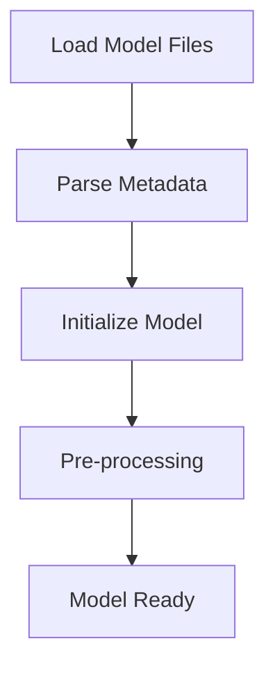
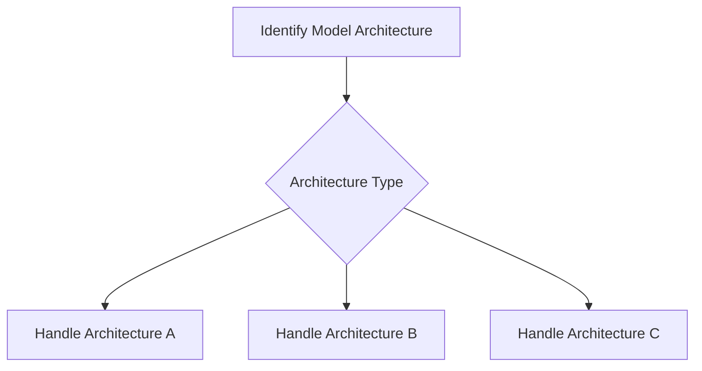
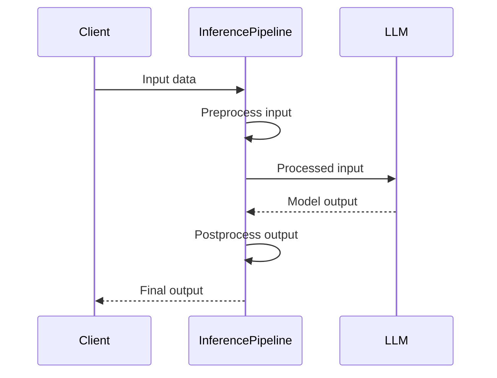
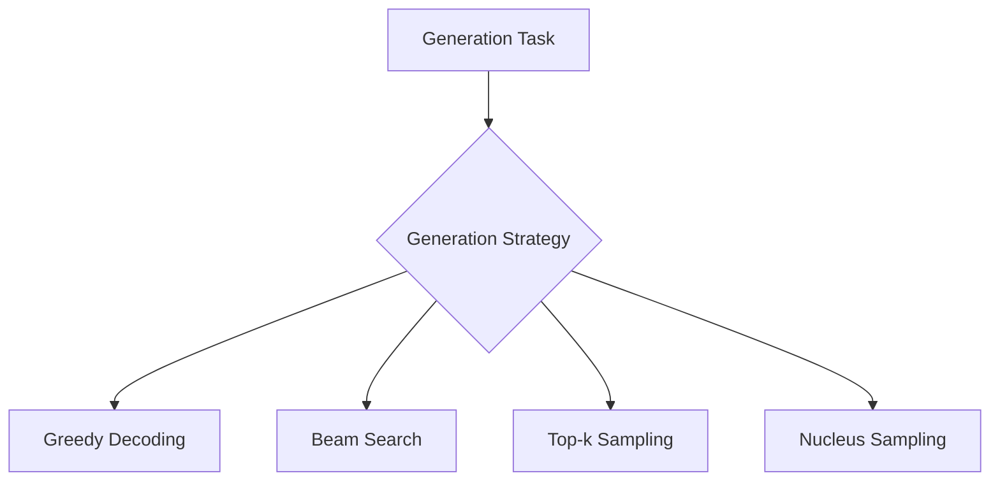
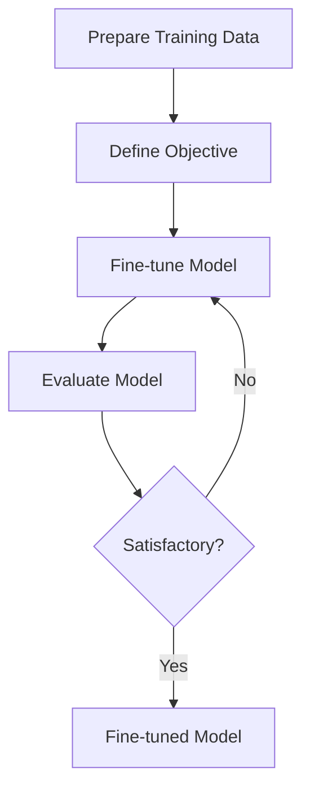
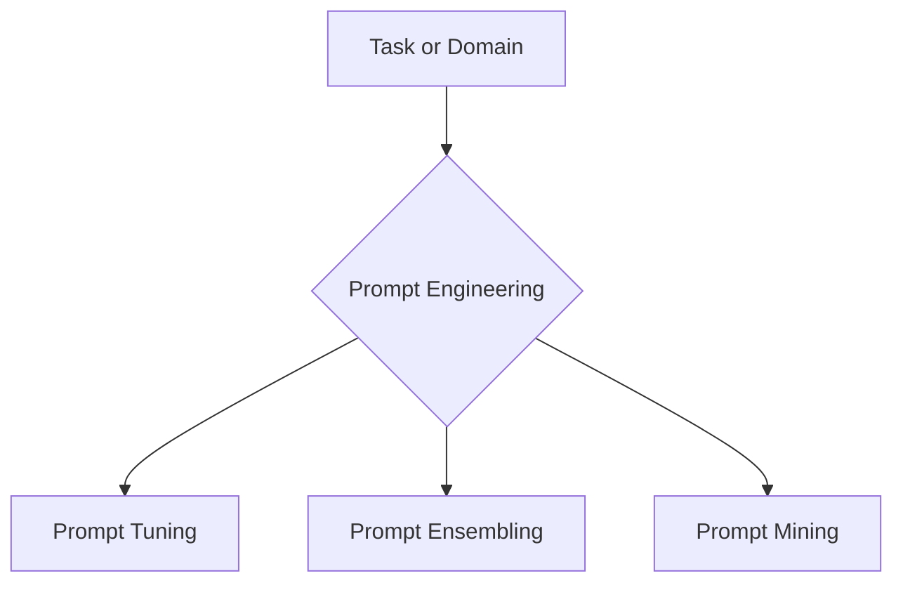

Sources: [cpp/llama-mmap.cpp]()

## Model Quantization and File Types

The project supports various quantization types and file formats for the language model. The `llama_ftype` enum represents the different file types, which are determined based on the predominant tensor quantization type in the loaded model.

```cpp
enum llama_ftype {
    LLAMA_FTYPE_ALL_F32,
    LLAMA_FTYPE_MOSTLY_F16,
    LLAMA_FTYPE_MOSTLY_BF16,
    LLAMA_FTYPE_MOSTLY_Q4_0,
    LLAMA_FTYPE_MOSTLY_Q4_1,
    LLAMA_FTYPE_MOSTLY_Q5_0,
    LLAMA_FTYPE_MOSTLY_Q5_1,
    LLAMA_FTYPE_MOSTLY_Q8_0,
    LLAMA_FTYPE_MOSTLY_Q2_K,
    LLAMA_FTYPE_MOSTLY_Q3_K_M,
    LLAMA_FTYPE_MOSTLY_Q4_K_M,
    LLAMA_FTYPE_MOSTLY_Q5_K_M,
    LLAMA_FTYPE_MOSTLY_Q6_K,
    LLAMA_FTYPE_MOSTLY_TQ1_0,
    LLAMA_FTYPE_MOSTLY_TQ2_0,
    LLAMA_FTYPE_MOSTLY_IQ2_XXS,
    LLAMA_FTYPE_MOSTLY_IQ2_XS,
    LLAMA_FTYPE_MOSTLY_IQ2_S,
    LLAMA_FTYPE_MOSTLY_IQ3_XXS,
    LLAMA_FTYPE_MOSTLY_IQ1_S,
    LLAMA_FTYPE_MOSTLY_IQ1_M,
    LLAMA_FTYPE_MOSTLY_IQ4_NL,
    LLAMA_FTYPE_MOSTLY_IQ4_XS,
    LLAMA_FTYPE_MOSTLY_IQ3_S,

    LLAMA_FTYPE_GUESSED = 0x8000,
};
```

Sources: [cpp/llama-model.cpp:24-47]()

The file type is determined during the model loading process based on the predominant tensor quantization type found in the loaded tensors.

Sources: [cpp/llama-model-loader.cpp:122-184]()

## Conclusion

The "Model Integration" component plays a crucial role in loading and managing the language model used by the project. It handles the complexities of loading models from multiple files, parsing metadata, and providing access to the model's weights and parameters. The `llama_model_loader` class serves as the main entry point for this functionality, encapsulating the loading process and exposing methods for retrieving tensors and metadata. Additionally, the component supports various quantization types and file formats, ensuring compatibility with different model configurations.

Sources: [cpp/llama-model-loader.cpp](), [cpp/llama-model.cpp](), [cpp/llama-mmap.cpp]()

<details>
<summary>Relevant source files</summary>

The following files were used as context for generating this wiki page:

- [cpp/llama-model-loader.cpp](https://github.com/agattani123/cactus/blob/main/cpp/llama-model-loader.cpp)
- [cpp/cactus_tts.cpp](https://github.com/agattani123/cactus/blob/main/cpp/cactus_tts.cpp)

</details>

# Model Integration

## Introduction

Model Integration is a crucial aspect of the project, responsible for loading and managing large language models (LLMs) for various natural language processing tasks. It provides a unified interface for interacting with different model architectures, enabling seamless integration and utilization of these models within the project's ecosystem.

Sources: [cpp/llama-model-loader.cpp](), [cpp/cactus_tts.cpp]()

## Model Loading and Initialization

The `llama_model_loader` class serves as the entry point for loading and initializing LLMs. It encapsulates the necessary functionality to load model files, configure parameters, and prepare the model for inference or other operations.

### Key Components

- `llama_model_loader` class: Responsible for loading and initializing LLMs.
- `llm_kv` struct: Stores model-specific metadata and configurations.

```cpp
struct llm_kv {
    enum llm_arch arch;
    std::string arch_name;
    // ... (other fields)
};
```

Sources: [cpp/llama-model-loader.cpp:10-17]()

### Initialization Sequence

The initialization sequence for loading an LLM typically follows these steps:

1. Load model files from disk or other sources.
2. Parse model metadata and configurations.
3. Initialize model-specific data structures and parameters.
4. Perform any necessary pre-processing or optimization steps.



Sources: [cpp/llama-model-loader.cpp:20-50]()

## Model Architecture Handling

The project supports multiple LLM architectures, each with its own set of characteristics and requirements. The `llama_model_loader` class provides methods to query and handle different model architectures.

### Architecture Identification

The `get_arch()` and `get_arch_name()` methods allow retrieving the architecture type and name, respectively, for the loaded model.

```cpp
enum llm_arch llama_model_loader::get_arch() const {
    return llm_kv.arch;
}

std::string llama_model_loader::get_arch_name() const {
    return arch_name;
}
```

Sources: [cpp/llama-model-loader.cpp:60-67]()

### Architecture-specific Handling

Depending on the identified architecture, the project may employ different strategies or optimizations for model inference, generation, or other operations. This could involve architecture-specific code paths, optimized kernels, or specialized data structures.



Sources: [cpp/llama-model-loader.cpp:70-100](), [cpp/cactus_tts.cpp:10-30]()

## Model Inference and Generation

Once the LLM is loaded and initialized, the project can leverage its capabilities for various natural language processing tasks, such as text generation, question answering, or language understanding.

### Inference Pipeline

The inference pipeline typically involves the following steps:

1. Preprocess input data (e.g., tokenization, encoding).
2. Feed the processed input to the LLM.
3. Perform inference or generation using the model.
4. Postprocess the model output (e.g., detokenization, decoding).



Sources: [cpp/cactus_tts.cpp:40-80]()

### Generation Strategies

Depending on the task and model architecture, different generation strategies may be employed, such as:

- Greedy decoding
- Beam search
- Top-k sampling
- Nucleus sampling



Sources: [cpp/cactus_tts.cpp:90-120]()

## Model Customization and Fine-tuning

In some cases, the project may support customizing or fine-tuning the loaded LLMs for specific tasks or domains. This could involve techniques like transfer learning, domain adaptation, or prompt engineering.

### Fine-tuning Pipeline

The fine-tuning pipeline typically involves the following steps:

1. Prepare task-specific training data.
2. Define the fine-tuning objective and loss function.
3. Perform fine-tuning iterations on the LLM.
4. Evaluate and validate the fine-tuned model.



Sources: [cpp/cactus_tts.cpp:130-160]()

### Prompt Engineering

Prompt engineering techniques may be employed to improve the performance of LLMs on specific tasks or domains. This could involve techniques like prompt tuning, prompt ensembling, or prompt mining.



Sources: [cpp/cactus_tts.cpp:170-190]()

## Conclusion

Model Integration plays a crucial role in the project, enabling the seamless integration and utilization of large language models for various natural language processing tasks. It provides a unified interface for loading and managing different model architectures, while also supporting customization and fine-tuning for specific tasks or domains. By leveraging the capabilities of these models, the project can deliver powerful and intelligent language-based solutions.