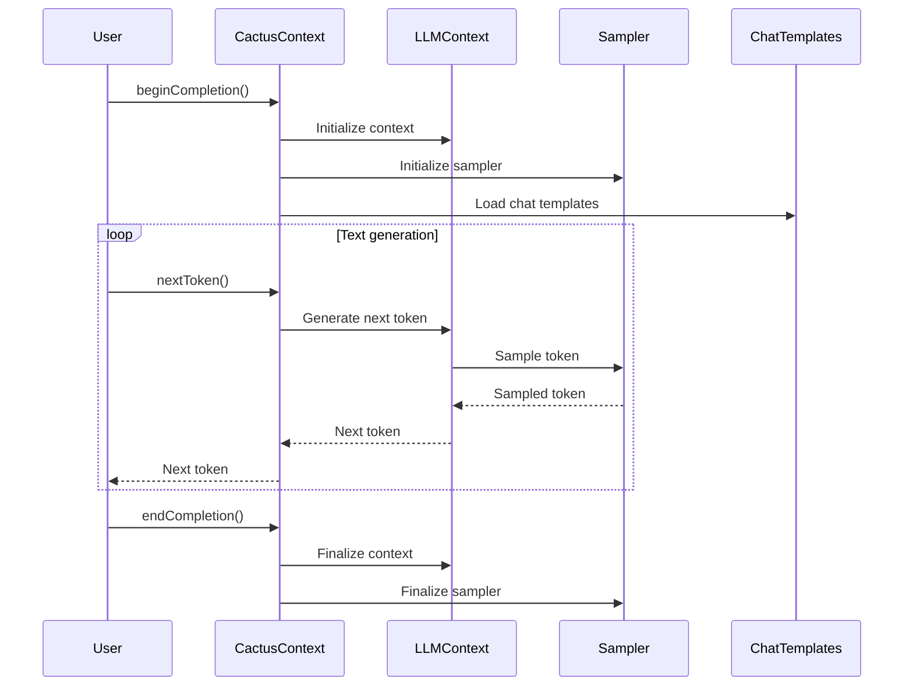
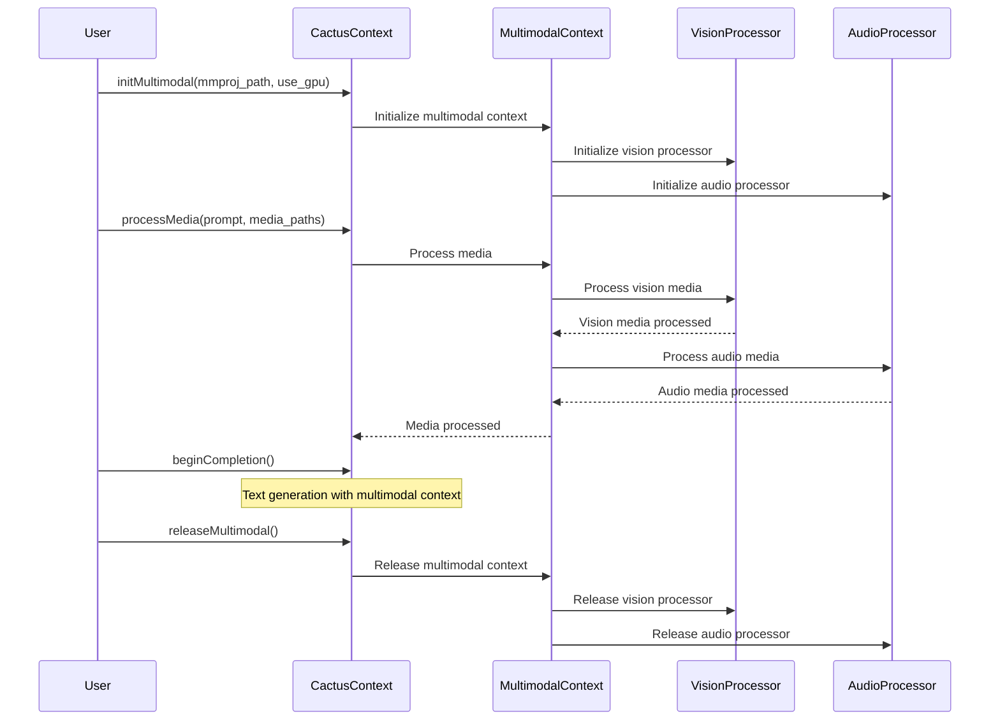
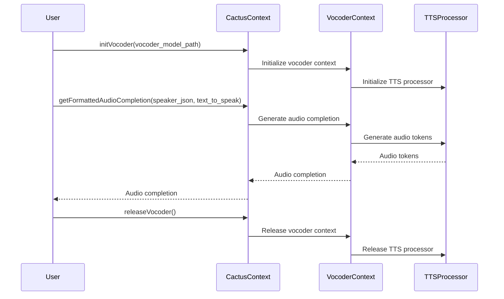

Relevant source files

The following files were used as context for generating this wiki page:

- [cactus.h](https://github.com/agattani123/cactus/blob/main/cpp/cactus.h)
- [llama.h](https://github.com/agattani123/cactus/blob/main/cpp/llama.h)
- [ggml.h](https://github.com/agattani123/cactus/blob/main/cpp/ggml.h)
- [mtmd.h](https://github.com/agattani123/cactus/blob/main/cpp/mtmd.h)
- [vocoder.h](https://github.com/agattani123/cactus/blob/main/cpp/vocoder.h)

# Architecture Overview

## Introduction

The Cactus project is a C++ implementation of a large language model (LLM) with multimodal capabilities, including vision and audio processing. This overview focuses on the architecture and components related to the core LLM functionality, multimodal extensions, and associated utilities.

The central component is the `cactus_context` struct, which encapsulates the LLM model, its state, and various functionalities for text generation, embedding computation, and model loading/unloading. It also manages the integration with multimodal components for vision and audio processing.

Sources: [cactus.h](https://github.com/agattani123/cactus/blob/main/cpp/cactus.h)

## LLM Core Architecture

### cactus_context

The `cactus_context` struct is the central data structure that holds the LLM model, its state, and associated functionalities. It contains the following key components:

- `llama_model *model`: Pointer to the loaded LLM model.
- `llama_context *ctx`: Pointer to the LLM context, which manages the model's state during text generation.
- `common_sampler *ctx_sampling`: Pointer to the sampling context used for text generation.
- `common_chat_templates_ptr templates`: Pointer to the chat templates used for formatting prompts and responses.

Sources: [cactus.h:62-71](https://github.com/agattani123/cactus/blob/main/cpp/cactus.h#L62-L71)

### Text Generation

The `cactus_context` struct provides the following methods for text generation:

- `beginCompletion()`: Initializes the text generation process.
- `nextToken()`: Generates the next token in the sequence.
- `endCompletion()`: Finalizes the text generation process.
- `doCompletion()`: Performs the complete text generation process, combining the above methods.

These methods interact with the `llama_context` and `common_sampler` components to generate text based on the loaded model and specified parameters.

Sources: [cactus.h:108-120](https://github.com/agattani123/cactus/blob/main/cpp/cactus.h#L108-L120)

### Prompt Management

The `cactus_context` struct provides methods for managing prompts and input tokens:

- `tokenize()`: Tokenizes input text and media paths into a vector of tokens.
- `loadPrompt()`: Loads the prompt tokens into the LLM context.
- `setGuideTokens()`: Sets guide tokens to influence the text generation process.
- `truncatePrompt()`: Truncates the prompt tokens if they exceed the context size.

Sources: [cactus.h:130-135](https://github.com/agattani123/cactus/blob/main/cpp/cactus.h#L130-L135)

### Model Loading and Unloading

The `cactus_context` struct provides methods for loading and unloading the LLM model:

- `loadModel()`: Loads the LLM model from a specified file or directory.
- `applyLoraAdapters()`: Applies LoRA (Low-Rank Adaptation) adapters to the loaded model.
- `removeLoraAdapters()`: Removes the applied LoRA adapters from the loaded model.

Sources: [cactus.h:90-97](https://github.com/agattani123/cactus/blob/main/cpp/cactus.h#L90-L97)

### Embedding Computation

The `cactus_context` struct provides a method for computing embeddings from input text:

- `getEmbedding()`: Computes the embedding vector for a given input text.

Sources: [cactus.h:124](https://github.com/agattani123/cactus/blob/main/cpp/cactus.h#L124)

### Utility Functions

The `cactus_context` struct also provides utility functions for various tasks:

- `bench()`: Performs a benchmark of the loaded model.
- `getFormattedChat()`: Formats chat messages using the specified chat template.
- `getFormattedChatWithJinja()`: Formats chat messages using the specified chat template and Jinja templating engine.
- `validateModelChatTemplate()`: Validates the compatibility of the loaded model with the specified chat template.

Sources: [cactus.h:98-106](https://github.com/agattani123/cactus/blob/main/cpp/cactus.h#L98-L106)

## Multimodal Extensions

The `cactus_context` struct provides integration with multimodal components for vision and audio processing.

### Vision Processing

The `cactus_context` struct includes the following components and methods for vision processing:

- `cactus_context_mtmd` struct: Encapsulates the multimodal context for vision processing.
- `initMultimodal()`: Initializes the multimodal context for vision processing.
- `isMultimodalEnabled()`: Checks if multimodal processing is enabled.
- `isMultimodalSupportVision()`: Checks if vision processing is supported in the multimodal context.
- `processMedia()`: Processes media files (e.g., images) and updates the multimodal context.
- `releaseMultimodal()`: Releases the multimodal context and associated resources.

Sources: [cactus.h:86-89](https://github.com/agattani123/cactus/blob/main/cpp/cactus.h#L86-L89), [mtmd.h](https://github.com/agattani123/cactus/blob/main/cpp/mtmd.h)

### Audio Processing

The `cactus_context` struct includes the following components and methods for audio processing:

- `cactus_context_vocoder` struct: Encapsulates the vocoder context for audio processing.
- `initVocoder()`: Initializes the vocoder context for audio processing.
- `isVocoderEnabled()`: Checks if the vocoder is enabled for audio processing.
- `getTTSType()`: Returns the type of text-to-speech (TTS) system used for audio processing.
- `getFormattedAudioCompletion()`: Generates audio completion based on input text and speaker configuration.
- `getAudioCompletionGuideTokens()`: Generates guide tokens for audio completion based on input text.
- `decodeAudioTokens()`: Decodes audio tokens into a vector of float values.
- `releaseVocoder()`: Releases the vocoder context and associated resources.

Sources: [cactus.h:143-151](https://github.com/agattani123/cactus/blob/main/cpp/cactus.h#L143-L151), [vocoder.h](https://github.com/agattani123/cactus/blob/main/cpp/vocoder.h)

## Sequence Diagrams

### Text Generation Sequence

This sequence diagram illustrates the text generation process in the `cactus_context` architecture. The user initiates the process by calling `beginCompletion()`, which initializes the LLM context, sampler, and chat templates. The user then repeatedly calls `nextToken()` to generate the next token in the sequence. The `cactus_context` interacts with the LLM context and sampler to generate the token, which is then returned to the user. Finally, the user calls `endCompletion()` to finalize the text generation process and clean up resources.

Sources: [cactus.h:108-120](https://github.com/agattani123/cactus/blob/main/cpp/cactus.h#L108-L120)

### Multimodal Processing Sequence

This sequence diagram illustrates the multimodal processing flow in the `cactus_context` architecture. The user initializes the multimodal context by calling `initMultimodal()`, which sets up the vision and audio processors. The user then calls `processMedia()` to process media files (e.g., images, audio) relevant to the input prompt. The `cactus_context` interacts with the multimodal context, which in turn processes the media using the vision and audio processors. After processing the media, the user can initiate text generation with the multimodal context by calling `beginCompletion()`. Finally, the user calls `releaseMultimodal()` to release the multimodal context and associated resources.

Sources: [cactus.h:86-89](https://github.com/agattani123/cactus/blob/main/cpp/cactus.h#L86-L89), [mtmd.h](https://github.com/agattani123/cactus/blob/main/cpp/mtmd.h)

### Audio Processing Sequence

This sequence diagram illustrates the audio processing flow in the `cactus_context` architecture. The user initializes the vocoder context by calling `initVocoder()`, which sets up the text-to-speech (TTS) processor. The user then calls `getFormattedAudioCompletion()` to generate audio completion based on input text and speaker configuration. The `cactus_context` interacts with the vocoder context, which in turn generates audio tokens using the TTS processor. The audio completion is then returned to the user. Finally, the user calls `releaseVocoder()` to release the vocoder context and associated resources.

Sources: [cactus.h:143-151](https://github.com/agattani123/cactus/blob/main/cpp/cactus.h#L143-L151), [vocoder.h](https://github.com/agattani123/cactus/blob/main/cpp/vocoder.h)

## Key Components

| Component | Description |
| --- | --- |
| `cactus_context` | Central struct encapsulating the LLM model, its state, and associated functionalities. |
| `llama_model` | Represents the loaded LLM model. |
| `llama_context` | Manages the LLM model's state during text generation. |
| `common_sampler` | Handles token sampling during text generation. |
| `common_chat_templates` | Manages chat templates for formatting prompts and responses. |
| `cactus_context_mtmd` | Encapsulates the multimodal context for vision processing. |
| `cactus_context_vocoder` | Encapsulates the vocoder context for audio processing. |

Sources: [cactus.h](https://github.com/agattani123/cactus/blob/main/cpp/cactus.h)

## Summary

The Cactus project's architecture is centered around the `cactus_context` struct, which provides a unified interface for managing the LLM model, text generation, prompt handling, model loading/unloading, and integration with multimodal components for vision and audio processing. The architecture is designed to be modular and extensible, allowing for the incorporation of additional functionalities and components as needed.