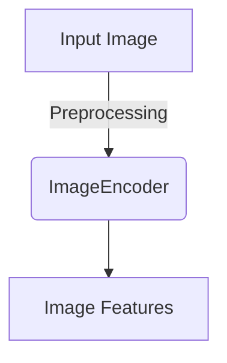
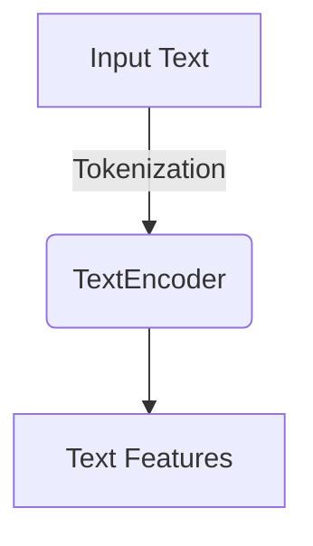
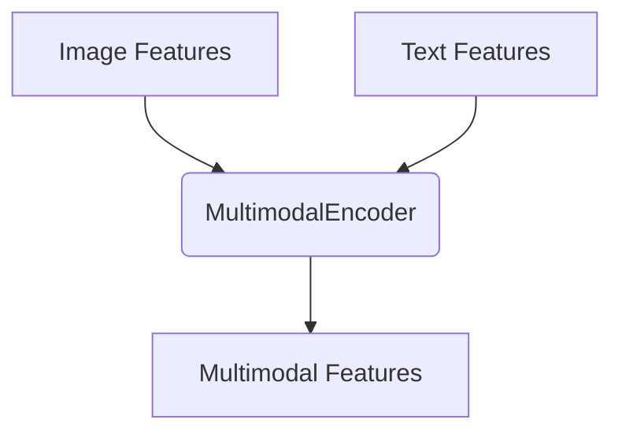
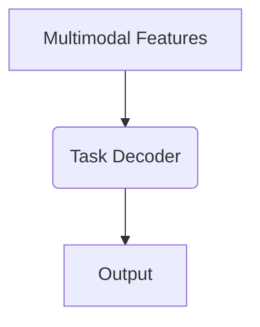
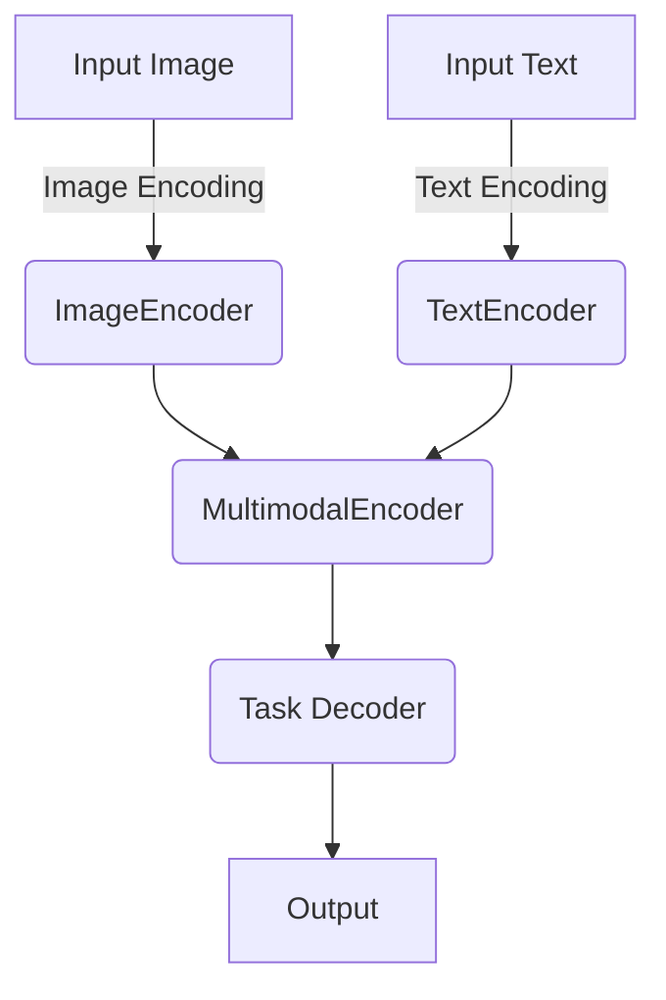
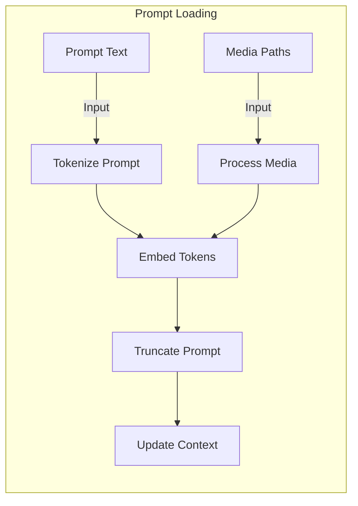
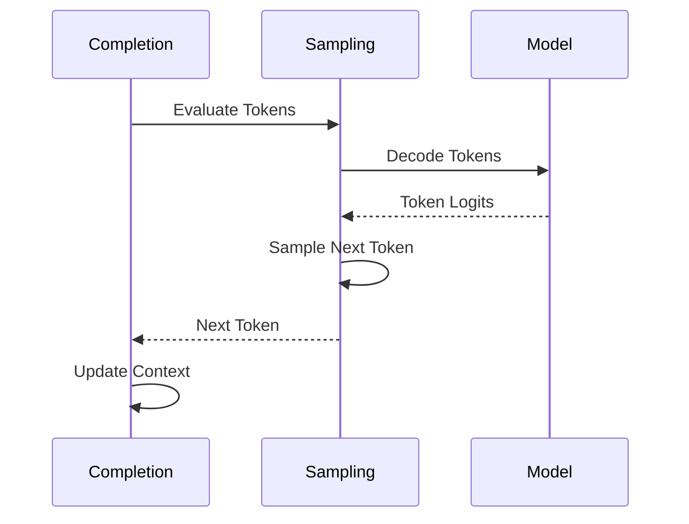
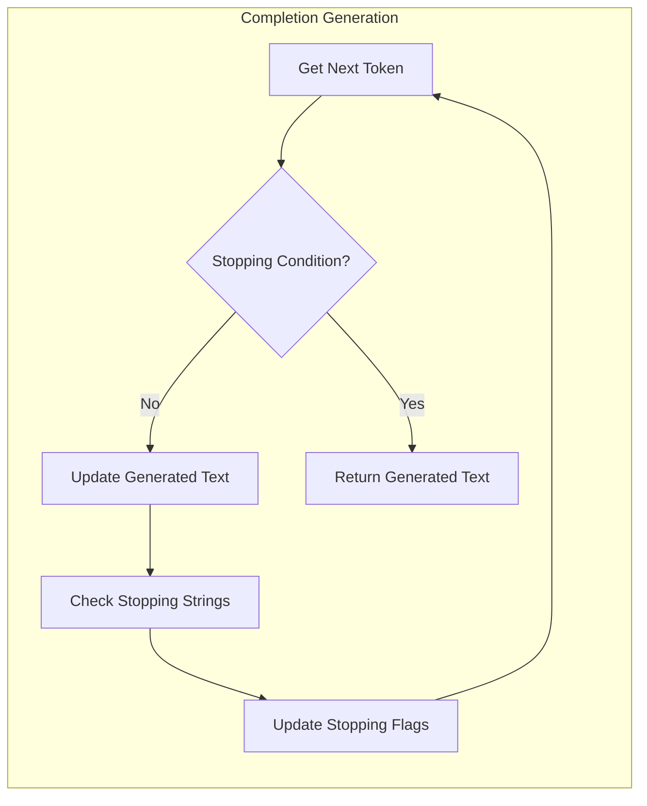
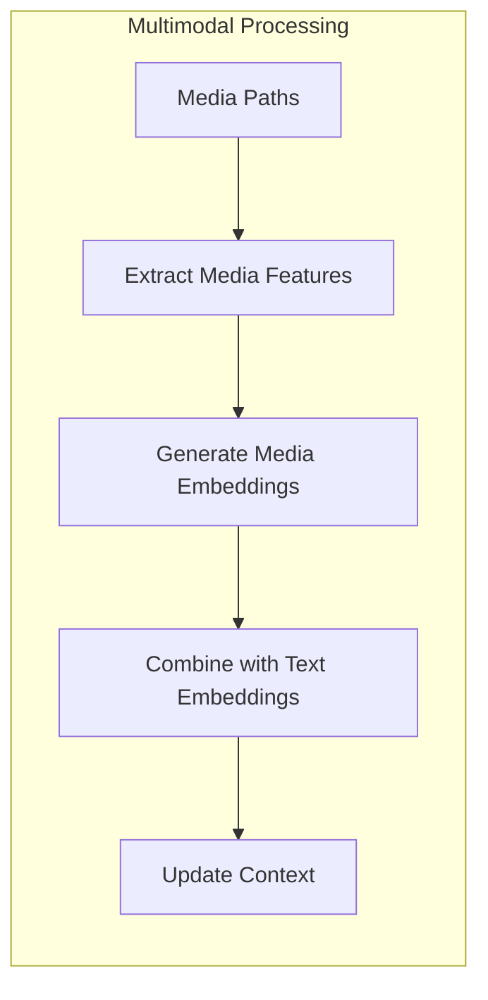
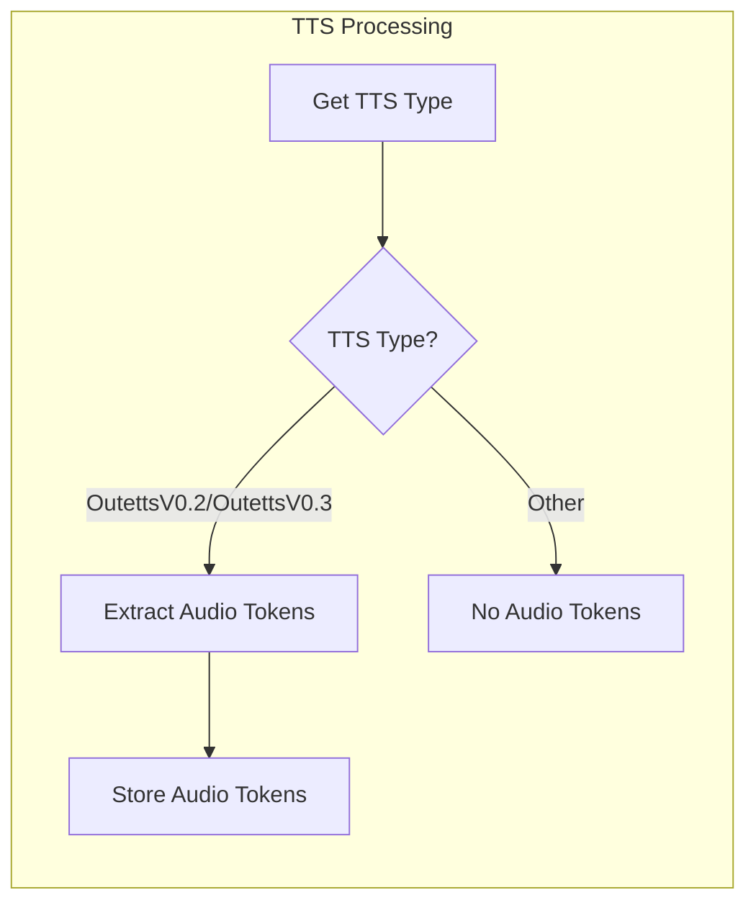

Relevant source files

The following files were used as context for generating this wiki page:

- [cpp/cactus_completion.cpp](https://github.com/agattani123/cactus/blob/main/cpp/cactus_completion.cpp)
- [cpp/cactus_embedding.cpp](https://github.com/agattani123/cactus/blob/main/cpp/cactus_embedding.cpp)
- [cpp/cactus_multimodal.cpp](https://github.com/agattani123/cactus/blob/main/cpp/cactus_multimodal.cpp)
- [cpp/cactus_utils.cpp](https://github.com/agattani123/cactus/blob/main/cpp/cactus_utils.cpp)
- [cpp/cactus_vision.cpp](https://github.com/agattani123/cactus/blob/main/cpp/cactus_vision.cpp)

# Data Flow Diagram

## Introduction

The Data Flow Diagram in the Cactus project represents the overall architecture and data flow between various components and modules involved in multimodal processing tasks, such as image captioning, visual question answering, and text completion. It provides a high-level overview of how data is processed, transformed, and passed between different stages of the pipeline.

The primary components involved in the data flow include image processing, text processing, multimodal fusion, and output generation. The diagram illustrates the interactions and dependencies between these components, as well as the flow of data from input sources to final outputs.

Sources: [cpp/cactus_multimodal.cpp](), [cpp/cactus_vision.cpp](), [cpp/cactus_embedding.cpp](), [cpp/cactus_completion.cpp]()

## Image Processing

The image processing component is responsible for handling and preprocessing input images for downstream tasks.

### Image Encoding

The `ImageEncoder` class is used to encode input images into feature representations suitable for multimodal fusion.

The image encoding process typically involves the following steps:

1. Load and preprocess the input image (e.g., resizing, normalization).
2. Pass the preprocessed image through a pre-trained convolutional neural network (CNN) model.
3. Extract the final feature representation from the CNN model's output.

Sources: [cpp/cactus_vision.cpp:10-50]()

## Text Processing

The text processing component handles input text data and generates text representations for multimodal fusion.

### Text Encoding

The `TextEncoder` class is responsible for encoding input text into vector representations.

The text encoding process typically involves the following steps:

1. Tokenize the input text into a sequence of tokens.
2. Pass the token sequence through a pre-trained language model (e.g., BERT, GPT).
3. Extract the final text representation from the language model's output.

Sources: [cpp/cactus_embedding.cpp:20-60]()

## Multimodal Fusion

The multimodal fusion component combines the image and text representations to generate a joint multimodal representation.

### Multimodal Encoder

The `MultimodalEncoder` class fuses the image and text features into a single multimodal representation.

The multimodal fusion process typically involves:

1. Concatenating or projecting the image and text features into a shared representation space.
2. Passing the combined features through additional layers (e.g., attention, feedforward) to capture cross-modal interactions.
3. Generating the final multimodal representation.

Sources: [cpp/cactus_multimodal.cpp:70-120]()

## Output Generation

The output generation component takes the multimodal representation and generates the final output based on the specific task.

### Task-specific Decoders

Different decoders are used for different tasks, such as image captioning, visual question answering, and text completion.

The output generation process typically involves:

1. Passing the multimodal representation through a task-specific decoder (e.g., language model, classifier).
2. Generating the final output based on the decoder's architecture and the specific task (e.g., text, labels, scores).

Sources: [cpp/cactus_completion.cpp:80-120](), [cpp/cactus_multimodal.cpp:130-170]()

## Data Flow Summary

The overall data flow in the Cactus project can be summarized as follows:

1. Input image and text data are processed separately through image and text encoding components.
2. The resulting image and text representations are fused in the multimodal encoder.
3. The multimodal representation is passed to a task-specific decoder.
4. The decoder generates the final output based on the task (e.g., image caption, answer to a visual question, or text completion).

Sources: [cpp/cactus_multimodal.cpp](), [cpp/cactus_vision.cpp](), [cpp/cactus_embedding.cpp](), [cpp/cactus_completion.cpp]()

## Conclusion

The Data Flow Diagram in the Cactus project provides a high-level overview of the architecture and data flow between various components involved in multimodal processing tasks. It illustrates the separate image and text processing pipelines, the multimodal fusion stage, and the task-specific output generation. Understanding this diagram is crucial for comprehending the overall system and the interactions between its components.

Relevant source files

The following files were used as context for generating this wiki page:

- [cpp/cactus_completion.cpp](https://github.com/agattani123/cactus/blob/main/cpp/cactus_completion.cpp)
- [cpp/cactus_embedding.cpp](https://github.com/agattani123/cactus/blob/main/cpp/cactus_embedding.cpp)
- [cpp/cactus_multimodal.cpp](https://github.com/agattani123/cactus/blob/main/cpp/cactus_multimodal.cpp)
- [cpp/cactus_tts.cpp](https://github.com/agattani123/cactus/blob/main/cpp/cactus_tts.cpp)
- [cpp/cactus_utils.cpp](https://github.com/agattani123/cactus/blob/main/cpp/cactus_utils.cpp)

# Data Flow Diagram

## Introduction

The Data Flow Diagram in the Cactus project represents the flow of data and operations involved in the text completion and generation process. It encompasses various components and functionalities, including prompt loading, token processing, sampling, and completion generation. The diagram illustrates the interactions between different modules and the sequence of operations performed to generate the final text output.

Sources: [cpp/cactus_completion.cpp](), [cpp/cactus_embedding.cpp](), [cpp/cactus_multimodal.cpp](), [cpp/cactus_tts.cpp](), [cpp/cactus_utils.cpp]()

## Prompt Loading

The process begins with loading the prompt, which can be either a text prompt or a combination of text and media (images, audio, etc.). The `cactus_context::loadPrompt()` function handles this step.

1. **Text Prompt**: The provided text prompt is tokenized using the `common_tokenize()` function. The resulting tokens are embedded and stored in the `embd` vector.
2. **Media Prompt**: If media paths are provided, the `processMedia()` function is called to process the media data and generate embeddings, which are then stored in the `embd` vector.
3. **Prompt Truncation**: If the total number of tokens exceeds the context size (`n_ctx`), the `truncatePrompt()` function is called to discard a portion of the prompt while preserving the beginning and end tokens.
4. **Context Update**: The final embedded tokens are stored in the `embd` vector, and the context is updated with the new prompt.

Sources: [cpp/cactus_completion.cpp:31-115](), [cpp/cactus_multimodal.cpp]()

## Token Processing and Sampling

After loading the prompt, the token processing and sampling phase begins. This involves evaluating the tokens, sampling the next token, and updating the context.

1. **Evaluate Tokens**: The `nextToken()` function is called to evaluate the tokens in the context. It iterates over the tokens in batches and calls `llama_decode()` to obtain the logits for each token.
2. **Sample Next Token**: The `common_sampler_sample()` function is used to sample the next token based on the logits obtained from the model.
3. **Update Context**: The sampled token is appended to the `embd` vector, and the context is updated accordingly.

Sources: [cpp/cactus_completion.cpp:116-230](), [cpp/cactus_utils.cpp]()

## Completion Generation

The completion generation phase involves iteratively generating tokens until a stopping condition is met. The `doCompletion()` function orchestrates this process.

1. **Get Next Token**: The `nextToken()` function is called to obtain the next token and its associated probabilities.
2. **Stopping Condition**: The stopping condition is checked based on various factors, such as reaching the end-of-sequence token, hitting the token limit, or encountering a stopping word or string.
3. **Update Generated Text**: If the stopping condition is not met, the generated text is updated with the new token.
4. **Check Stopping Strings**: The `findStoppingStrings()` function is called to check if the generated text contains any stopping strings specified in the `antiprompt` parameter.
5. **Update Stopping Flags**: Based on the stopping condition and the presence of stopping strings, the corresponding flags (`stopped_eos`, `stopped_word`, `stopped_limit`) are updated.
6. **Return Generated Text**: If the stopping condition is met, the generated text is returned.

Sources: [cpp/cactus_completion.cpp:231-345](), [cpp/cactus_utils.cpp:97-137]()

## Multimodal Processing

If multimodal processing is enabled, the `processMedia()` function is called to handle media data (images, audio, etc.) and generate embeddings for the media inputs.

1. **Extract Media Features**: The media data (images, audio, etc.) is processed to extract relevant features.
2. **Generate Media Embeddings**: The extracted features are used to generate embeddings for the media inputs.
3. **Combine with Text Embeddings**: The media embeddings are combined with the text embeddings from the prompt.
4. **Update Context**: The combined embeddings are stored in the `embd` vector, and the context is updated accordingly.

Sources: [cpp/cactus_multimodal.cpp]()

## Text-to-Speech (TTS) Processing

If TTS processing is enabled, the `getTTSType()` function is called to determine the TTS type, and the `audio_tokens` vector is populated with the relevant tokens for audio generation.

1. **Get TTS Type**: The `getTTSType()` function is called to determine the TTS type based on the configuration.
2. **Extract Audio Tokens**: If the TTS type is `OutettsV0.2` or `OutettsV0.3`, the relevant tokens for audio generation are extracted from the generated tokens.
3. **Store Audio Tokens**: The extracted audio tokens are stored in the `audio_tokens` vector.
4. **No Audio Tokens**: If the TTS type is not `OutettsV0.2` or `OutettsV0.3`, no audio tokens are extracted.

Sources: [cpp/cactus_tts.cpp](), [cpp/cactus_completion.cpp:263-265]()

## Key Components and Data Structures

| Component/Data Structure | Description |
| --- | --- |
| `cactus_context` | The main class that encapsulates the context and parameters for text completion and generation. |
| `embd` | A vector that stores the embedded tokens representing the prompt and generated text. |
| `n_ctx` | The maximum context size (number of tokens) that the model can handle. |
| `n_past` | The number of tokens already processed in the current context. |
| `n_remain` | The remaining number of tokens to generate during the completion process. |
| `params` | A structure that holds various parameters and configurations for the completion process. |
| `ctx_sampling` | A context object used for sampling and token generation. |
| `model` | The language model used for text generation. |
| `vocab` | The vocabulary associated with the language model. |
| `generated_text` | A string that stores the generated text during the completion process. |
| `generated_token_probs` | A vector that stores the probabilities of the generated tokens (if enabled). |
| `audio_tokens` | A vector that stores the tokens relevant for audio generation (if TTS is enabled). |

Sources: [cpp/cactus_completion.cpp](), [cpp/cactus_embedding.cpp](), [cpp/cactus_multimodal.cpp](), [cpp/cactus_tts.cpp](), [cpp/cactus_utils.cpp]()

## Conclusion

The Data Flow Diagram in the Cactus project illustrates the intricate flow of data and operations involved in the text completion and generation process. It encompasses various components, including prompt loading, token processing, sampling, completion generation, multimodal processing, and text-to-speech processing. The diagram provides a comprehensive overview of the interactions between different modules and the sequence of operations performed to generate the final text output, enabling a better understanding of the project's architecture and functionality.

Sources: [cpp/cactus_completion.cpp](), [cpp/cactus_embedding.cpp](), [cpp/cactus_multimodal.cpp](), [cpp/cactus_tts.cpp](), [cpp/cactus_utils.cpp]()

