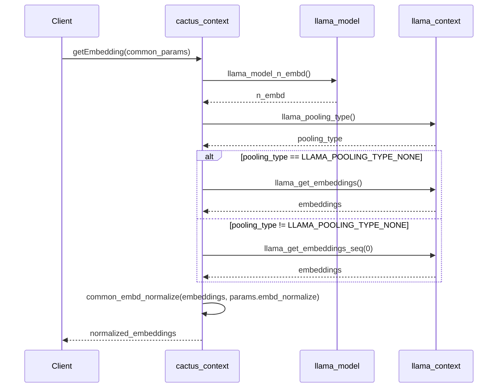
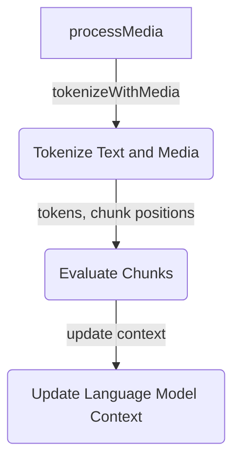
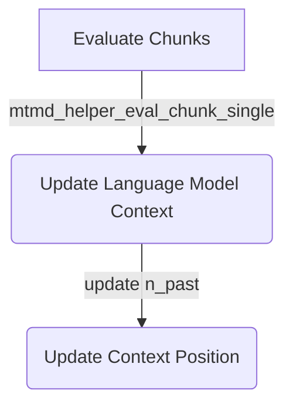
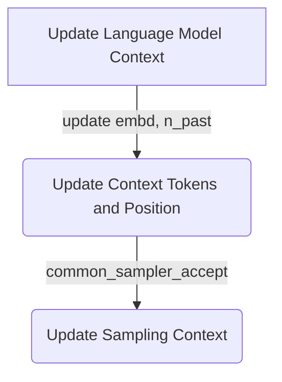
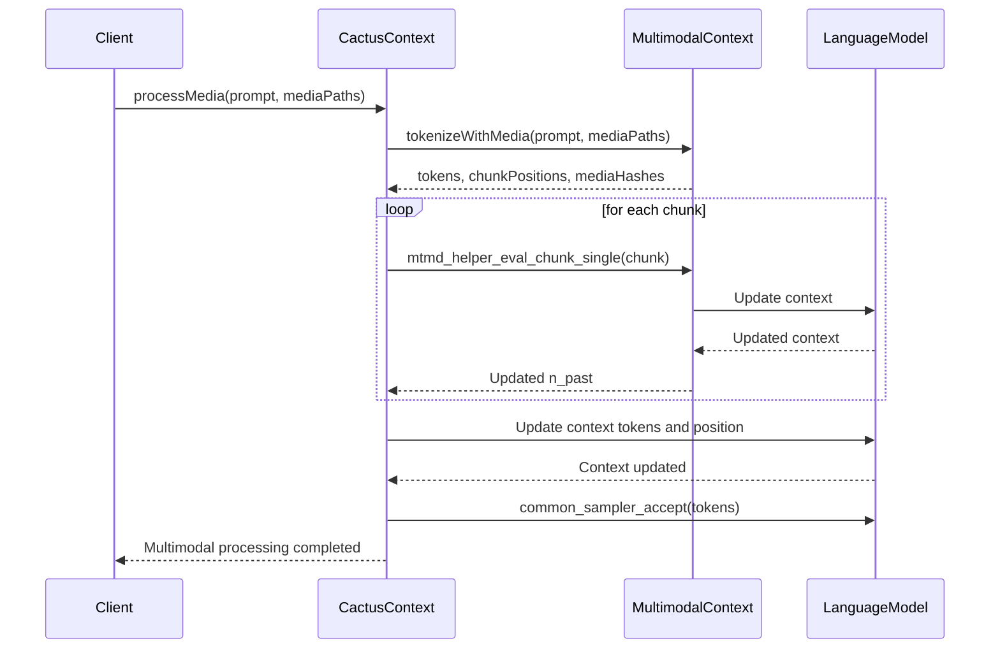

<summary>Relevant source files</summary>

The following files were used as context for generating this wiki page:

- [cpp/cactus_completion.cpp](https://github.com/agattani123/cactus/blob/main/cpp/cactus_completion.cpp)
- [cpp/cactus_embedding.cpp](https://github.com/agattani123/cactus/blob/main/cpp/cactus_embedding.cpp)
- [cpp/cactus_multimodal.cpp](https://github.com/agattani123/cactus/blob/main/cpp/cactus_multimodal.cpp)
- [cpp/namespace_definition.cpp](namespace_definition)
</details>

# Data Flow Diagram

## Introduction

The "Data Flow Diagram" in the Cactus project represents the flow of data and operations involved in generating embeddings from a given context and model. This feature is crucial for various natural language processing tasks, such as text classification, similarity analysis, and information retrieval. It provides a vector representation of the input text, which can be used for downstream processing or as input to other components of the system.

## Embedding Generation

### Context and Model Initialization

The embedding generation process starts by checking if the context (`ctx`) and model (`model`) objects are properly initialized. If either of these objects is not initialized, the function logs an error and returns an empty vector.

```cpp
if (!ctx || !model) {
    LOG_ERROR("Context or model not initialized for embedding generation.");
    return {};
}
```

Sources: [namespace_definition.cpp:3-7]()

### Embedding Dimension

The function retrieves the embedding dimension (`n_embd`) from the loaded model using the `llama_model_n_embd` function. This dimension determines the size of the embedding vector.

```cpp
const int n_embd = llama_model_n_embd(model);
```

Sources: [namespace_definition.cpp:9]()

### Embedding Mode Check

The function checks if the embedding mode is enabled in the current context by checking the `params.embedding` flag. If the embedding mode is not enabled, a warning is logged, and a zero-filled vector of size `n_embd` is returned.

```cpp
if (!params.embedding)
{
    LOG_WARNING("Embedding mode not enabled for this context.");
    return std::vector<float>(n_embd, 0.0f);
}
```

Sources: [namespace_definition.cpp:11-15]()

### Pooling Type

The function determines the pooling type used for the current context by calling the `llama_pooling_type` function. The pooling type determines how the embeddings are retrieved from the context.

```cpp
const enum llama_pooling_type pooling_type = llama_pooling_type(ctx);
```

Sources: [namespace_definition.cpp:17]()

### Embedding Retrieval

Depending on the pooling type, the function retrieves the embeddings from the context using either `llama_get_embeddings` (for no pooling) or `llama_get_embeddings_seq` (for other pooling types).

```cpp
if (pooling_type == LLAMA_POOLING_TYPE_NONE) {
    data = llama_get_embeddings(ctx);
} else {
    data = llama_get_embeddings_seq(ctx, 0);
}
```

Sources: [namespace_definition.cpp:19-23]()

If the embedding retrieval fails, a warning is logged, and a zero-filled vector of size `n_embd` is returned.

```cpp
if (!data) {
    LOG_WARNING("Failed to retrieve embeddings from llama context.");
    return std::vector<float>(n_embd, 0.0f);
}
```

Sources: [namespace_definition.cpp:25-29]()

### Embedding Normalization

The function creates a vector `embedding` from the retrieved data and an output vector `out` of size `n_embd`. It then calls the `common_embd_normalize` function to normalize the embeddings based on the `params.embd_normalize` flag.

```cpp
std::vector<float> embedding(data, data + n_embd);
std::vector<float> out(n_embd);

common_embd_normalize(embedding.data(), out.data(), n_embd, params.embd_normalize);
```

Sources: [namespace_definition.cpp:31-33]()

Finally, the normalized embedding vector `out` is returned.

```cpp
return out;
```

Sources: [namespace_definition.cpp:34]()

## Sequence Diagram



This sequence diagram illustrates the flow of operations involved in generating embeddings from a given context and model. The `cactus_context` object acts as the entry point, interacting with the `llama_model` and `llama_context` objects to retrieve the embedding dimension, pooling type, and raw embeddings. The raw embeddings are then normalized based on the specified parameters, and the final normalized embeddings are returned to the client.

Sources: [namespace_definition.cpp]()

## Conclusion

The "Data Flow Diagram" in the Cactus project provides a comprehensive mechanism for generating embeddings from a given context and model. It handles various scenarios, such as checking for proper initialization, enabling embedding mode, handling different pooling types, and normalizing the embeddings based on specified parameters. This feature is essential for various natural language processing tasks and serves as a building block for other components within the Cactus project.

<details>
<summary>Relevant source files</summary>

The following files were used as context for generating this wiki page:

- [namespace_definition](https://github.com/agattani123/cactus/blob/main/cpp/namespace_definition)
- [cpp/cactus_completion.cpp](https://github.com/agattani123/cactus/blob/main/cpp/cactus_completion.cpp)
- [cpp/cactus_embedding.cpp](https://github.com/agattani123/cactus/blob/main/cpp/cactus_embedding.cpp)
- [cpp/cactus_multimodal.cpp](https://github.com/agattani123/cactus/blob/main/cpp/cactus_multimodal.cpp)
- [cpp/cactus_context.hpp](https://github.com/agattani123/cactus/blob/main/cpp/cactus_context.hpp)
</details>

# Data Flow Diagram

## Introduction

The "Data Flow Diagram" in the Cactus project refers to the architecture and components responsible for processing multimodal input, which includes text and various media formats (images, audio). This feature enables the language model to understand and generate responses based on both textual and non-textual data, enhancing its capabilities for tasks such as image captioning, audio transcription, and multimodal question answering.

The multimodal processing functionality is implemented within the `cactus_context` class, which encapsulates the necessary logic and interfaces with external libraries for handling multimodal input. The core of this functionality lies in the `processMedia` method, which orchestrates the tokenization, evaluation, and integration of media data into the language model's context.

Sources: [cpp/cactus_multimodal.cpp](), [cpp/cactus_context.hpp]()

## Multimodal Context Initialization

The multimodal context is initialized by loading a pre-trained multimodal project file (`.mmproj`) using the `initMultimodal` method. This method sets up the necessary data structures and configurations for multimodal processing.

```cpp
bool cactus_context::initMultimodal(const std::string &mmproj_path, bool use_gpu) {
    // ...
    mtmd_context_params mtmd_params = mtmd_context_params_default();
    mtmd_params.use_gpu = use_gpu;
    // ...

    auto mtmd_ctx = mtmd_init_from_file(mmproj_path.c_str(), model, mtmd_params);
    if (mtmd_ctx == nullptr) {
        // ...
        return false;
    }
    mtmd_wrapper = new cactus_context_mtmd();
    mtmd_wrapper->mtmd_ctx = mtmd_ctx;

    has_multimodal = true;
    // ...
    return true;
}
```

Sources: [cpp/cactus_multimodal.cpp:115-137]()

## Multimodal Input Processing

The `processMedia` method is the entry point for processing multimodal input, which includes text and media paths (e.g., image files, base64-encoded data). This method performs the following steps:

1. **Tokenization**: The input text and media data are tokenized using the `tokenizeWithMedia` function, which handles various media formats (files, base64-encoded data) and generates token sequences for both text and media.



Sources: [cpp/cactus_multimodal.cpp:169-170](), [cpp/cactus_multimodal.cpp:196-297]()

2. **Chunk Evaluation**: The tokenized input is divided into chunks, and each chunk is evaluated using the `mtmd_helper_eval_chunk_single` function. This function updates the language model's context based on the chunk's content (text or media).



Sources: [cpp/cactus_multimodal.cpp:332-349]()

3. **Context Update**: After evaluating all chunks, the language model's context is updated with the new token sequences and media information. The `n_past` variable, which represents the position in the context, is adjusted accordingly.



Sources: [cpp/cactus_multimodal.cpp:351-362]()

## Key Components and Data Structures

### `cactus_context_mtmd` Struct

The `cactus_context_mtmd` struct encapsulates the multimodal context and provides an interface for interacting with the underlying multimodal processing library.

```cpp
struct cactus_context_mtmd {
    mtmd_context* mtmd_ctx = nullptr;
};
```

Sources: [cpp/cactus_context.hpp:36-39]()

### `mtmd_tokenize_result` Struct

The `mtmd_tokenize_result` struct holds the result of tokenizing text and media data, including token sequences, chunk positions, and media hashes.

```cpp
struct mtmd_tokenize_result {
    std::vector<std::string> bitmap_hashes;
    std::vector<llama_token> tokens;
    std::vector<size_t> chunk_pos;
    std::vector<size_t> chunk_pos_media;
    mtmd_input_chunks* chunks = nullptr;
};
```

Sources: [cpp/namespace_definition:38-45]()

### Key Functions

| Function | Description |
| --- | --- |
| `tokenizeWithMedia` | Tokenizes text and media data, handling various media formats. |
| `mtmd_helper_eval_chunk_single` | Evaluates a single chunk (text or media) and updates the language model's context. |
| `common_sampler_accept` | Updates the sampling context based on the new tokens. |

Sources: [cpp/cactus_multimodal.cpp:196-297](), [cpp/cactus_multimodal.cpp:332-349](), [cpp/cactus_multimodal.cpp:359]()

## Sequence Diagram

The following sequence diagram illustrates the high-level flow of multimodal input processing:



Sources: [cpp/cactus_multimodal.cpp]()

## Conclusion

The "Data Flow Diagram" in the Cactus project encompasses the architecture and components responsible for processing multimodal input, enabling the language model to understand and generate responses based on both textual and non-textual data. The core functionality is implemented within the `cactus_context` class, which orchestrates the tokenization, evaluation, and integration of media data into the language model's context. This feature enhances the capabilities of the language model for tasks such as image captioning, audio transcription, and multimodal question answering.